# Gagaodok cross-device sync agreement

_가가오독 Mac·Android phone·Android tablet 대화 동기화에 관한 기술 합의 — 2026-08-26_

---

| Field | Value |
| --- | --- |
| **Status** | Technical agreement; implementation not approved |
| **Prepared by** | Codex, based on the completed Codex–Claude Code cross-review |
| **Pending review** | Claude Code review of this consolidated document |
| **Product decisions** | Reserved for the user; listed as `Decision pending` |
| **Source documents** | [Original proposal](2026-08-26-cross-device-sync-proposal.md), [reviewed r2 draft](2026-08-26-cross-device-sync-proposal-r2.md) |
| **Data access during review** | Source code only; no actual conversation file was opened |

> ⚠️ **Boundary:** This agreement authorizes neither real-data upload nor bidirectional sync. Product decisions and phase gates below must be completed first.

## 📋 Agreement status and scope

Codex and Claude Code agree on the technical facts, safety requirements, canonical data boundaries, and rollout gates in this document. Remaining open items are either product choices reserved for the user or measurements that have not yet been performed.

This document supersedes the technical conclusions in the two proposal drafts when they conflict with this agreement. The drafts remain preserved as review history.

### User experience in scope

- Preserve the three existing app experiences rather than merging the apps into one
- Show fixed `폰 · Mac · 태블릿` source tabs on phone, with `폰` as the default
- Allow Mac- and tablet-origin rooms to become bidirectional through phone only after Phase 5 gates pass
- Keep phone-origin rooms hidden from Mac and tablet by default until the user decides otherwise
- Never merge rooms by display name
- Preserve local-first operation and offline access
- Expand existing rooms only by explicit opt-in

### Implementation status

- Phase 0 inventory and rollback work may begin using non-destructive paths
- Phase 1 contract work and Phase 2 synthetic Cloudflare tests may begin
- A synthetic Phase 4 read-only UI prototype may begin
- Real-data Phase 3 Shadow Upload is blocked by its decision and acceptance gates
- Phase 5 bidirectional sync is blocked by its durability, concurrency, and compatibility gates

## 🎯 Non-negotiable principles

1. **Local data remains authoritative until an operation is durably recorded.** Cloud failure must not prevent local use.
2. **Source identity is explicit.** A room is identified by source space and UUID, never by display name.
3. **Canonical and local schemas are different contracts.** Platform-specific data must not be erased by another platform's decoder.
4. **Existing JSON is not a sync protocol.** Sync uses dedicated DTOs, revisions, operations, and tombstones.
5. **Import must be non-destructive.** Inventory and Shadow Upload must not migrate or rewrite source files.
6. **Logical turns and visible bubbles are separate entities.** One AI response may contain several visible bubbles.
7. **Unknown fields survive.** The server preserves opaque extensions that a client does not understand.
8. **Deletion is explicit.** Missing data is never interpreted as a deletion without a tombstone operation.
9. **Rollback is proven before upload.** Backup creation alone is insufficient; restore into an isolated location must succeed.
10. **A safe false mismatch is preferred.** Incompatible cache or compaction artifacts must be ignored rather than silently reused.

## 💾 Canonical data contract

### Conversation identity

```text
conversation_scope = (space_id, room_id, worldline_id?)
turn_identity      = (conversation_scope, turn_id)
bubble_identity    = (conversation_scope, turn_id, bubble_order, message_id)
```

- `space_id` distinguishes phone, Mac, and tablet source spaces
- `room_id` retains the existing room UUID
- `worldline_id` is a nullable storage axis, not a later optional feature
- `turn_id` identifies a logical user or AI turn
- `bubble_order` is new and replaces reliance on JSON array position
- `message_id` identifies one visible bubble
- `speakerRoomId` remains bubble metadata and never becomes a turn boundary

Phase 4 remote replicas must use a separate store or storage root. The current local stores use room UUIDs as primary lookup keys, so remote replicas must not be mixed into them before composite identity support exists.

### Turn and bubble ownership

| Entity | Canonical fields |
| --- | --- |
| **Turn** | `turn_id`, sender, `canonical_text`, completion status, reply/base turn reference, turn-level `heart_changes` or immutable affection event references |
| **Bubble** | `message_id`, `bubble_order`, visible text, kind, timestamp, `speakerRoomId`, attachment reference, reactions |
| **Conversation scope** | `space_id`, `room_id`, nullable `worldline_id`, engine profile, revision |
| **Device state** | unread state, delivery failure, pin state, local cache and render state |

The current Android files store `canonicalText` on the first bubble and `heartChanges` on the last bubble. Those are storage anchors, not canonical ownership. Deleting an anchor bubble must not silently mutate the logical turn.

### Deterministic legacy turn identity

The importer must not call the existing random-ID migration or write to the source JSON.

1. Preserve every existing non-null `turnId`
2. Group only bubbles with exactly the same existing `turnId`
3. Group consecutive AI bubbles only while all bubbles in that legacy run have `turnId == nil`; stop before any non-null ID
4. Derive a nil AI run's canonical `turn_id` from its first `message.id`
5. Derive each nil user message's canonical `turn_id` from its own `message.id`
6. Preserve `speakerRoomId` as bubble metadata without using it as a boundary

This gives repeated imports the same result without changing the original file.

### Field ownership

The following values are local or derived and must not be treated as shared room truth:

| Field | Ownership |
| --- | --- |
| `unreadCount`, `isUnread` | Device-local |
| `deliveryFailed` | Device-local send state |
| `isPinned` | Device-local UI state |
| `lastMessageText`, `lastMessageTime` | Derived from canonical messages |
| render/search/object caches | Device-local |
| `avatarImageFileName` | Local pointer; meaningless without the file payload |

Android-only fields such as `baseAffection`, `groupChat`, `suppressedExpressions`, `sampleEvidence`, `speakerRoomId`, `reactions`, and `heartChanges` must be mapped explicitly or preserved as opaque extensions. Whole-object round trips through a platform that lacks these fields are prohibited.

## 🔐 Mutation, deletion, and durability contract

### Field patch

Existing room or message fields use a sync-specific patch envelope rather than RFC 7396 merge patch:

```json
{
  "base_revision": 41,
  "set": {
    "statusMessage": "새 상태"
  },
  "clear": [
    "avatarImageFileName"
  ]
}
```

- `clear` may be emitted at mutation time or derived from a known base snapshot
- `base_revision` is required for conflict detection
- The existing Swift and Kotlin storage codecs remain unchanged
- Whole-room and whole-message `PUT` operations are prohibited

### Entity deletion

Field clearing and entity deletion are separate protocols:

| Operation | Meaning |
| --- | --- |
| `delete_bubble` | Tombstone one visible bubble while preserving its logical turn |
| `delete_turn` | Tombstone a logical turn and all child bubbles |

The receiver must never infer either operation from a missing array element. A tombstone carries the target identity, operation ID, base revision, actor/device, and server ordering information.

Current deletion semantics differ:

- Mac deletes every bubble sharing the selected message's `turnId`
- Android deletes only the selected `message.id`

Android bubble deletion can remove the first bubble's `canonicalText` or the last bubble's `heartChanges` while leaving the turn and current affection value in place. The canonical turn entity therefore owns those values independently of whichever local bubble anchors them.

Before bubble deletion is enabled, the contract must define:

- Whether deleting the last remaining bubble promotes to `delete_turn` or creates a headless turn
- How turn-level fields are re-anchored when projecting canonical data back to local JSON
- Whether deleting a turn reverses affection, hides only the visible history, or preserves an immutable affection audit event
- Whether both platforms expose the same delete choices

Until the user decides these points, synchronized rooms reject or do not emit edit and delete operations. The reviewers recommend making AI response deletion turn-atomic on both platforms for the first enabled version.

### Durable local-first operations

- Local content and its outbox/journal record must become durable as one recoverable operation
- Startup reconciliation must detect local content without an outbox record and outbox records without committed local content
- Local write success must be observable; Android `renameTo(...) == false` cannot be treated as success
- Normal lifecycle flushes reduce risk but do not cover crash, force-kill, power loss, or process death before persistence
- D1 applies the operation, canonical row, and change log transactionally; D1 `batch()` is transactional[^3]
- Every remote write is idempotent by operation ID

### Generation authority

Phase 5 starts with one text-only mentor test room, one active writer at a time, and one explicitly assigned AI generation authority. Requests include the base turn or revision. Concurrent or offline branches must not silently generate from divergent context.

## 🔄 Rollout and phase gates

```mermaid
flowchart LR
    accTitle: Cross Device Sync Gates
    accDescr: Rollout advances from local inventory through synthetic cloud tests to real shadow upload, read-only display, and one-room bidirectional sync only after each required gate passes.

    agreement([📋 Technical agreement]) --> inventory[🔍 Run Phase 0 inventory]
    inventory --> contract[⚙️ Build Phase 1 contract]
    contract --> synthetic[🧪 Run Phase 2 synthetic tests]
    synthetic --> phase_three_gate{🔒 Phase 3 gate passed?}
    phase_three_gate -->|Yes| shadow_upload[📤 Copy real data]
    phase_three_gate -->|No| blocked([⚠️ Keep real data local])
    shadow_upload --> read_only[📥 Validate read-only tabs]
    read_only --> phase_five_gate{🔒 Phase 5 gate passed?}
    phase_five_gate -->|Yes| bidirectional([🔄 Open one test room])
    phase_five_gate -->|No| blocked

    classDef process fill:#dbeafe,stroke:#2563eb,stroke-width:2px,color:#1e3a5f
    classDef decision fill:#fef9c3,stroke:#ca8a04,stroke-width:2px,color:#713f12
    classDef success fill:#dcfce7,stroke:#16a34a,stroke-width:2px,color:#14532d
    classDef blocked_style fill:#fee2e2,stroke:#dc2626,stroke-width:2px,color:#7f1d1d

    class agreement,inventory,contract,synthetic,shadow_upload,read_only process
    class phase_three_gate,phase_five_gate decision
    class bidirectional success
    class blocked blocked_style
```



### Phase 0: Inventory and rollback proof

- Create per-device export archives without logging conversation text
- Produce raw-byte hash manifests before using any typed decoder
- Restore each archive into an isolated test location
- Run the inventory metrics defined below
- Do not enable sync if restore or non-destructive verification fails

### Phase 1: Canonical contract and fixtures

- Define canonical schema v1 and platform adapters
- Add synthetic Swift/Kotlin round-trip fixtures
- Verify unknown extension preservation, tombstones, revisions, UUIDs, dates, and bubble order
- Add duplicate-display-name fixtures and nullable worldline fixtures
- Define attachment and encryption envelopes after the user decides their policies

### Phase 2: Synthetic Cloudflare namespace

- Use a database and Worker namespace isolated from production data
- Test authentication, authorization, idempotency, indexes, delta pull, tombstones, and transactional batches
- Measure rows read/written, CPU time, payload size, and query plans with synthetic data
- Do not upload real conversation content

### Phase 3: Real-data Shadow Upload

Phase 3 is blocked until all of the following are complete:

- The user decides attachment/avatar handling
- The user decides whether historical uploads use E2EE
- The user decides phone-room backup behavior
- Group/worldline data is either supported by the canonical scope or explicitly excluded
- The non-destructive importer passes byte, mtime, and hash equality checks
- Deterministic legacy turn identity passes repeated-import tests
- Backup restore succeeds

Shadow Upload copies local data to immutable import batches. It never applies D1 data back to local files.

### Phase 4: Phone read-only source tabs

- Keep remote replicas in a separate store
- Validate duplicate names, search, sorting, avatar fallback, long previews, offline cache, and source labels
- Do not write back to origin files
- A synthetic prototype may precede Phase 3; real-data validation depends on Phase 3 completion

### Phase 5: One-room bidirectional test

Phase 5 is blocked until all of the following are complete:

- Durable outbox/journal and startup reconciliation work
- Local write failures propagate to callers
- Generation authority and concurrent/offline writer policy are defined
- Local and canonical fields are separated
- `base_revision` plus explicit `set`/`clear` patches pass contract tests
- Compactor and cache compatibility tests pass or incompatible artifacts are ignored
- Rollback of the one test room is proven

Initial Phase 5 restrictions:

- One new, text-only mentor test room
- One active writer and one generation authority
- No attachment payloads unless their policy is already approved and tested
- No message edit, `delete_bubble`, or `delete_turn`
- No shared affection behavior; use `relationshipPolicy = none` unless the user decides otherwise

### Later phases

Existing rooms become opt-in one at a time only after the test room succeeds. Shared checkpoints, explicit provider-cache leases, group/worldline exposure, attachments, affection, and real-time notification remain separate expansions with their own gates.

## 🔍 Phase 0 inventory agreement

Inventory reads raw files through a dedicated non-writing path and reports counts, sizes, IDs, and timing statistics only. It does not print conversation text.

### Required metrics

- Files containing any nil `turnId`
- Files containing any non-null `turnId`
- Per consecutive AI run, `distinctNonNullTurnIdCount`
- Immediate-risk files where any nil exists and an AI run has more than one distinct non-null `turnId`
- Files containing `speakerRoomId`, for inventory only
- Per AI run, maximum adjacent timestamp gap and counts above 5, 30, and 60 seconds
- Attachment count, encoded-size distribution, and largest payload sizes
- Avatar file count and size distribution
- Worldline file count and group-room count
- Raw file count, byte count, and hash manifest by source space

### Interpretation

| Distinct non-null turn IDs in an AI run | Interpretation |
| ---: | --- |
| `0` | All IDs are nil; legacy state |
| `1` | Normal single turn or previously collapsed history; current data alone cannot distinguish them |
| `2+` | Distinct turns are currently preserved; any nil elsewhere in the file creates immediate migration risk |

Timestamp gaps are triage signals only:

- A large gap marks the file `suspected`, never `confirmed damaged`
- No large gap leaves the file `unknown`, not `safe`
- The current code does not enforce a 0.45-second bubble interval
- The 60-second value used by Mac is a visual grouping threshold, not a turn boundary
- Deleting an intervening user message can make two AI response turns adjacent on both platforms
- Only comparison with a pre-migration archive can confirm historical collapse

## ⚙️ Compaction and provider cache agreement

### Checkpoint compatibility

One numeric `compactionVersion` is insufficient. Checkpoints use three separate fields:

| Field | Purpose |
| --- | --- |
| `checkpointSchemaVersion` | Serialized checkpoint structure |
| `compactionProfileId` | Human-managed policy name |
| `compactionContractFingerprint` | Machine-computed compatibility fingerprint |

The fingerprint uses a canonical byte representation containing:

- Runtime summary instruction text
- Threshold, verbatim window, refresh period, and segment token budget
- Actual `maxOutputTokens`
- Transcript format version
- Model and thinking configuration
- Checkpoint range algorithm version

Canonical UTF-8, line endings, field order, and serialization rules must be identical across platforms. The existing prefix-cache fingerprint implementations are not reusable because Swift sorts JSON keys while Android hashes insertion-order JSON.

### Current profile differences

| Profile | Threshold/window/refresh | Budget/output | Summary instruction |
| --- | --- | --- | --- |
| Mac mentor | `60/20/40` | `1200/2400` | Seven sections including documents |
| Mac companion | `80/30/50` | `1500/2700` | Mac companion instruction |
| Android mentor | `80/30/50` | `1500/2700` | Six-section Android mentor instruction |
| Android companion | `80/30/50` | `1500/2700` | Android companion instruction |

Existing unversioned digests are `legacy_unversioned`. They are never assumed to match the current profile. Before cross-device continuation, choose one of these strategies: consume as an opaque read-only summary, regenerate from original messages, or allow only the source-space owner to extend it.

Changing Android compaction constants is a separate product and regression decision. It must not be folded silently into sync implementation.

### Prefix-cache compatibility

Current Mac and Android cache fingerprints and creation thresholds differ, so cross-device reuse is disabled by default. A future experiment must bypass the local fingerprint, use a cache name directly, never log credential values, and compare same-project and different-project credentials. Credential scope means project, authentication identity, and permissions, not literal key equality.

## 🤔 User decisions pending

The following items are intentionally unresolved. Reviewer recommendations are not user approval.

| Decision | Reviewer recommendation | Required before | Status |
| --- | --- | --- | --- |
| Historical-upload E2EE | Decide before any real upload | Phase 3 | `Decision pending` |
| Attachment and avatar payloads | Use R2 or exclude payloads with explicit unavailable metadata | Phase 3 | `Decision pending` |
| Phone-room D1 backup | Back up in phone space but keep hidden from other spaces | Phase 3 | `Decision pending` |
| Group/worldline upload | Support in canonical scope or explicitly exclude | Phase 3 | `Decision pending` |
| Mac rooms visible on tablet | Keep disabled initially | UI rollout | `Decision pending` |
| New room creation in remote tabs | Disable initially; continue existing rooms only | Phase 5 | `Decision pending` |
| Friend-tab source tabs | Do not add initially | UI rollout | `Decision pending` |
| Shared engine compatibility | Read-only when unsupported; never silently fall back | Phase 5 | `Decision pending` |
| Shared affection behavior | Use `relationshipPolicy = none` initially | Phase 5 | `Decision pending` |
| Delete semantics | Prefer turn-atomic AI deletion; decide bubble deletion and headless turns | Before delete enablement | `Decision pending` |
| Affection after deletion | Decide rollback, hide-only, or immutable audit semantics | Before delete enablement | `Decision pending` |
| Android compactor alignment | Treat as a separate change with regression testing | Before policy change | `Decision pending` |
| Gemini credential scope | Run direct cache-name experiment | Before shared cache | `Decision pending` |
| Polling or real-time notifier | Start with cursor polling | Later phase | `Decision pending` |
| Edit/delete rollout phase | Keep disabled in initial Phase 5 | Before enablement | `Decision pending` |

## ✅ Acceptance, unknowns, and review

### Not yet measured or verified

- Actual counts of legacy, mixed-generation, worldline, group, attachment, and avatar data
- Whether any historical turn collapse already occurred
- Restore success for each real device archive
- Worker CPU usage under the 10 ms Free-plan budget
- Real D1 row-read/write consumption and database sizing
- Cross-credential Gemini cache accessibility
- End-to-end behavior on real Mac, phone, and tablet devices

### Cloud constraints already verified

Workers Free currently includes 100,000 requests per day and 10 ms CPU per invocation.[^1] D1 Free allows a maximum 500 MB database, 5 GB total account storage, and 2 MB per row, string, or BLOB.[^2] Inline Base64 attachments therefore cannot be placed directly in ordinary D1 rows.

### Definition of ready for implementation

This agreement is ready to guide implementation only after:

- Claude Code reviews this consolidated document
- The user resolves every decision connected to the phase being started
- Phase-specific fixtures and acceptance tests are written
- The work remains isolated from unrelated local changes

### Review log

| Date | Reviewer | Outcome |
| --- | --- | --- |
| 2026-08-26 | Codex and Claude Code | Multi-round technical cross-review converged |
| 2026-08-26 | Codex | Consolidated agreement prepared; Claude Code review pending |

## 🔗 References

### Project evidence

- [Reviewed r2 proposal](2026-08-26-cross-device-sync-proposal-r2.md)
- [Original proposal](2026-08-26-cross-device-sync-proposal.md)
- [Mac message model](../Sources/KakaoSapiens/Models/Message.swift)
- [Mac room storage and legacy migration](../Sources/KakaoSapiens/Models/ChatRoom.swift)
- [Android message model](../android/app/src/main/java/com/sapiens/gagaodok/model/Message.kt)
- [Android room storage and legacy migration](../android/app/src/main/java/com/sapiens/gagaodok/data/ChatStore.kt)
- [Android chat view model and group response persistence](../android/app/src/main/java/com/sapiens/gagaodok/ui/screens/ChatRoomViewModel.kt)
- [Mac compactor](../Sources/KakaoSapiens/Services/ConversationCompactor.swift)
- [Android compactor](../android/app/src/main/java/com/sapiens/gagaodok/service/ConversationCompactor.kt)
- [Mac prefix cache](../Sources/KakaoSapiens/Services/GeminiService+PrefixCache.swift)
- [Android prefix cache](../android/app/src/main/java/com/sapiens/gagaodok/service/AIServicePrefixCache.kt)

### External references

[^1]: Cloudflare. "Workers pricing and limits." https://developers.cloudflare.com/workers/platform/pricing/

[^2]: Cloudflare. "D1 platform limits." https://developers.cloudflare.com/d1/platform/limits/

[^3]: Cloudflare. "D1 Database API — batch transactions." https://developers.cloudflare.com/d1/worker-api/d1-database/

_Last updated: 2026-08-26_
