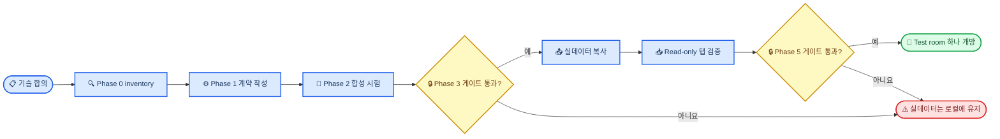

# 가가오독 크로스 디바이스 동기화 기술 합의문

_가가오독 Mac·Android phone·Android tablet 대화 동기화에 관한 기술 합의 — 2026-08-26_

---

| 항목 | 내용 |
| --- | --- |
| **상태** | 기술 합의 완료 / 구현 승인 아님 |
| **작성** | Codex, Codex–Claude Code 교차검증 결과 통합 |
| **후속 검토** | 이번 보완본에 대한 Claude Code 검토 대기 |
| **제품 결정** | 사용자 결정 대기; `결정 필요`로 표시 |
| **원본 문서** | [최초 제안서](2026-08-26-cross-device-sync-proposal.md), [검토 과정의 r2 문서](2026-08-26-cross-device-sync-proposal-r2.md) |
| **검토 중 데이터 접근** | 소스 코드만 검토; 실제 대화 파일은 열지 않음 |

> ⚠️ **경계:** 이 합의문은 실데이터 업로드나 양방향 동기화를 승인하지 않는다. 아래 제품 결정과 단계별 게이트를 먼저 충족해야 한다.

## 📋 합의 상태와 범위

Codex와 Claude Code는 이 문서에 적힌 기술적 사실, 안전 요건, canonical 데이터 경계, 단계별 게이트에 합의했다. 남은 항목은 사용자가 정할 제품 선택이거나 아직 수행하지 않은 실측이다.

이 문서는 내용이 충돌할 경우 두 제안서의 기술적 결론보다 우선한다. 최초 제안서와 r2 문서는 검토 이력으로 보존하며 더 이상 동기화해 고치지 않는다.

### 포함하는 사용자 경험

- 세 앱을 하나로 합치지 않고 현재의 Mac·폰·태블릿 경험을 유지한다.
- 폰에 고정된 `폰 · Mac · 태블릿` 출처 탭을 표시하고 기본 탭은 `폰`으로 둔다.
- Phase 5 게이트를 통과한 뒤에만 Mac·태블릿 출처 방을 폰에서 양방향으로 사용할 수 있다.
- 사용자가 달리 결정하기 전까지 폰 출처 방은 Mac과 태블릿에서 숨긴다.
- 표시 이름이 같다는 이유로 방을 자동 병합하지 않는다.
- local-first 동작과 오프라인 접근을 유지한다.
- 기존 방 확장은 명시적인 opt-in으로만 수행한다.

### 구현 가능 상태

- Phase 0 inventory와 rollback 검증은 비파괴 경로로 시작할 수 있다.
- Phase 1 계약 작성과 Phase 2 합성 Cloudflare 시험은 시작할 수 있다.
- 합성 데이터만 쓰는 Phase 4 read-only UI prototype은 시작할 수 있다.
- 실데이터를 쓰는 Phase 3 Shadow Upload는 관련 결정과 acceptance gate가 충족될 때까지 보류한다.
- Phase 5 양방향 동기화는 durability·concurrency·compatibility gate가 충족될 때까지 보류한다.

## 🎯 변경할 수 없는 원칙

1. **작업이 durable하게 기록될 때까지 로컬 데이터가 권위 원본이다.** Cloud 장애가 로컬 사용을 막으면 안 된다.
2. **출처 identity를 명시한다.** 방은 출처 space와 UUID로 식별하며 표시 이름으로 식별하지 않는다.
3. **Canonical schema와 local schema는 서로 다른 계약이다.** 한 플랫폼의 decoder가 다른 플랫폼 전용 데이터를 지우면 안 된다.
4. **현재 JSON 파일을 sync protocol로 사용하지 않는다.** 동기화에는 전용 DTO, revision, operation, tombstone을 사용한다.
5. **Import는 비파괴여야 한다.** Inventory와 Shadow Upload가 원본 파일을 migrate하거나 다시 쓰면 안 된다.
6. **논리적 turn과 화면의 bubble은 별도 entity다.** AI 응답 하나가 여러 말풍선으로 표시될 수 있다.
7. **알 수 없는 필드를 보존한다.** 서버는 client가 이해하지 못하는 opaque extension을 유지한다.
8. **삭제를 명시한다.** Tombstone operation 없이 사라진 데이터를 삭제로 해석하지 않는다.
9. **업로드 전에 rollback을 증명한다.** Backup 생성만으로 충분하지 않으며 격리된 위치에 restore가 성공해야 한다.
10. **안전한 false mismatch를 선호한다.** 호환되지 않는 cache나 compaction 산출물은 잘못 재사용하지 않고 무시한다.

## 💾 Canonical 데이터 계약

### 대화 identity

```text
conversation_scope = (space_id, room_id, worldline_id?)
turn_identity      = (conversation_scope, turn_id)
bubble_identity    = (conversation_scope, turn_id, bubble_order, message_id)
```

- `space_id`는 폰·Mac·태블릿 출처 space를 구분한다.
- `room_id`는 기존 방 UUID를 유지한다.
- `worldline_id`는 nullable storage axis이며 나중에 덧붙일 선택 기능으로 취급하지 않는다.
- `turn_id`는 사용자 또는 AI의 논리적 turn을 식별한다.
- `bubble_order`는 새 canonical 필드이며 JSON 배열 위치 의존을 대체한다.
- `message_id`는 화면에 표시되는 말풍선 하나를 식별한다.
- `speakerRoomId`는 bubble metadata로 유지하며 turn 경계로 사용하지 않는다.

Phase 4 remote replica는 별도 store 또는 storage root를 사용해야 한다. 현재 local store의 기본 조회 키는 room UUID 하나이므로 composite identity를 지원하기 전에는 remote replica를 현재 store에 섞지 않는다.

### `bubble_order` 확정과 불변성

기존 데이터의 순서를 알 수 있는 출처는 원본 JSON 배열 순서다. 비파괴 historical import가 원본 순서를 보존한 상태에서 다음 규칙으로 확정한다.

1. 최초 canonical import에서 원본 배열 index로 각 `message_id`의 `bubble_order`를 정한다.
2. 확정된 mapping은 `(conversation_scope, message_id)`에 대해 고정하며 같은 원본을 다시 import해도 같은 값을 낸다.
3. 삭제 후 번호가 듬성듬성해지는 것은 정상이다. 번호의 연속성을 요구하거나 빈 번호를 누락 데이터·삭제 증거로 해석하지 않는다.
4. 삭제·정렬·재동기화 뒤에도 기존 bubble을 재번호 매기지 않는다.
5. 새 bubble은 기존 순서를 바꾸지 않는 뒤쪽의 stable order를 받는다.

중간 삽입을 지원해야 하는 기능이 생기면 edit 기능을 열기 전에 별도의 stable ordering 규격을 먼저 정한다. 여기서 중요한 것은 파일을 읽을 기회가 한 번뿐이라는 뜻이 아니라, **원본 순서가 보존된 최초 canonical import에서 mapping을 확정하고 이후 바꾸지 않는 것**이다.

### Turn과 bubble의 소유 필드

| Entity | Canonical 필드 |
| --- | --- |
| **Turn** | `turn_id`, sender, `canonical_text`, completion status, reply/base turn reference, turn-level `heart_changes` 또는 immutable affection event reference |
| **Bubble** | `message_id`, `bubble_order`, visible text, kind, timestamp, `speakerRoomId`, attachment reference, reactions |
| **Conversation scope** | `space_id`, `room_id`, nullable `worldline_id`, `engineProfile`, revision |
| **Device state** | unread state, delivery failure, pin state, local cache와 render state |

현재 Android 파일은 첫 bubble에 `canonicalText`, 마지막 bubble에 `heartChanges`를 저장한다. 이는 local storage anchor일 뿐 canonical ownership이 아니다. Anchor bubble 삭제가 논리적 turn을 조용히 바꾸면 안 된다.

### `engineProfile`과 `relationshipPolicy`

`engineProfile`은 방을 어느 기기에서 열어도 같은 AI 동작 계약을 해석하기 위한 room-level canonical profile이다. Provider credential이나 API key 자체를 담지 않는다. Phase 1에서 정확한 schema를 고정하되 최소한 다음 의미를 명시해야 한다.

| 항목 | 의미 |
| --- | --- |
| mode | mentor·companion 등 대화 동작 모드 |
| model capability profile | 특정 제품명 fallback이 아니라 필요한 model capability와 generation 동작 |
| prompt profile | system/persona prompt 계약과 그 version |
| `relationshipPolicy` | 관계·호감도 동작 계약 |
| `compactionProfileId` | 사람이 관리하는 압축 정책 이름 |
| `compactionContractFingerprint` | 실제 압축 동작의 기계 판정용 fingerprint |
| cache policy | provider cache 생성·재사용 호환성 계약 |

`relationshipPolicy`의 초기 허용값은 다음과 같다.

| 값 | 의미 |
| --- | --- |
| `none` | 호감도 prompt·상태 변화를 사용하지 않음 |
| `personal` | 개인 companion 관계 정책 사용 |
| `group` | group/worldline 관계 정책 사용 |

현재 Android의 `BuildConfig.TABLET_MENTOR` 분기는 service·ViewModel·UI를 포함한 **9개 파일 16곳**에 퍼져 있으므로 service 한 곳만 `engineProfile`로 바꾸는 작업으로 끝나지 않는다. 특히 `personalAffectionEnabled`는 현재 `(flavor × mode × model)`의 함수인데 이 가운데 flavor는 동기화되지 않는다. 따라서 동기화 구현은 build flavor를 추측하지 말고 필요한 동작을 room-level profile에 명시해야 한다. 지원하지 않는 profile은 read-only로 열고 조용한 fallback은 금지한다.

### 결정적인 legacy `turn_id`

Importer는 기존 random-ID migration을 호출하거나 원본 JSON을 쓰면 안 된다.

1. 기존 non-null `turnId`는 모두 보존한다.
2. 기존 `turnId`가 정확히 같은 bubble끼리만 묶는다.
3. AI bubble의 연속 구간은 모두 `turnId == nil`인 동안에만 묶고 non-null ID 직전에 끊는다.
4. Nil AI 구간의 canonical `turn_id`는 첫 `message.id`에서 결정한다.
5. Nil 사용자 메시지의 canonical `turn_id`는 자기 `message.id`에서 결정한다.
6. `speakerRoomId`는 bubble metadata로 보존하고 경계로 사용하지 않는다.

같은 원본을 반복 import해도 이 규칙은 같은 결과를 내며 원본 파일은 바꾸지 않는다.

> ⚠️ **구현 경고:** Mac의 `loadMessagesForRoom(roomId:)`와 Android의 `loadMessages(...)`는 단순 read API가 아니다. 두 함수 모두 내부에서 `migrateLegacyTurns`를 실행하고 변경이 감지되면 같은 원본 파일을 다시 쓴다. Inventory와 importer는 이 일반 loader를 호출하지 말고 raw bytes 전용 read/decode 경로를 사용해야 한다.

### 필드 ownership

다음 값은 local 또는 derived 상태이며 공유 room truth로 취급하지 않는다.

| 필드 | Ownership |
| --- | --- |
| `unreadCount`, `isUnread` | Device-local |
| `deliveryFailed` | Device-local send state |
| `isPinned` | Device-local UI state |
| `lastMessageText`, `lastMessageTime` | Canonical message에서 파생 |
| render/search/object cache | Device-local |
| `avatarImageFileName` | 파일 payload 없이는 의미 없는 local pointer |

`baseAffection`, `groupChat`, `suppressedExpressions`, `sampleEvidence`, `speakerRoomId`, `reactions`, `heartChanges` 같은 Android 전용 필드는 명시적으로 mapping하거나 opaque extension으로 보존한다. 해당 필드가 없는 플랫폼을 거치는 whole-object round trip은 금지한다.

### 첨부와 아바타 경계

- Android 입력 경로에는 원본 첨부에 **12MB** 상한이 있다. Base64로 바꾸면 payload가 약 **16MB**까지 커질 수 있다.
- Mac 입력 경로에는 현재 명시적인 첨부 크기 상한이 없다. Inventory와 importer는 Android의 12MB를 전체 데이터 상한으로 가정하면 안 된다.
- D1의 행·문자열·BLOB당 2MB 한도 때문에 일반 D1 row에 inline Base64 첨부를 넣을 수 없다.[^2]
- 아바타와 첨부 payload는 metadata와 분리하고, R2 사용 또는 payload 제외 정책을 사용자가 정해야 한다.
- Phase 0은 원문을 출력하지 않고 크기 분포와 최대값을 측정해야 한다. Import 구현은 Mac의 큰 첨부에 대한 memory·streaming 한계를 별도로 검증해야 한다.

## 🔐 변경·삭제·durability 계약

### 필드 patch

기존 room이나 message의 필드 변경은 RFC 7396 merge patch 대신 동기화 전용 patch envelope를 사용한다.

```json
{
  "base_revision": 41,
  "set": {
    "statusMessage": "새 상태"
  },
  "clear": [
    "avatarImageFileName"
  ]
}
```

- `clear`는 사용자가 값을 지우는 mutation 시점에 기록하거나 알려진 base snapshot과의 diff로 생성할 수 있다.
- Conflict detection을 위해 `base_revision`이 필요하다.
- 현재 Swift·Kotlin storage codec은 바꾸지 않는다.
- Whole-room·whole-message `PUT`은 금지한다.

RFC 7396을 사용하지 않는 이유도 계약의 일부다. Android codec은 `explicitNulls = false`이고 Swift의 여러 필드는 `decodeIfPresent(...) ?? false` 같은 방식으로 읽힌다. 따라서 현재 저장 JSON만으로는 **필드 부재**와 **명시적으로 값을 비움**을 안정적으로 구별할 수 없다. `null`을 삭제 명령으로 쓰는 merge patch로 되돌리지 않고, sync operation의 `set`과 `clear`를 명시적으로 유지한다.

### Entity 삭제

필드 clear와 entity 삭제는 서로 다른 protocol이다.

| Operation | 의미 |
| --- | --- |
| `delete_bubble` | 논리적 turn은 유지하면서 화면 bubble 하나를 tombstone 처리 |
| `delete_turn` | 논리적 turn과 모든 child bubble을 tombstone 처리 |

Receiver는 배열 원소가 없다는 이유로 어느 삭제도 추론하지 않는다. Tombstone에는 target identity, operation ID, base revision, actor/device, server ordering 정보를 담는다.

현재 플랫폼의 삭제 의미는 다르다.

- Mac은 선택한 message와 같은 `turnId`를 공유하는 모든 bubble을 지운다.
- Android는 선택한 `message.id` 하나만 지운다.

Android의 bubble 삭제는 turn과 현재 호감도 값은 남겨둔 채 첫 bubble의 `canonicalText` 또는 마지막 bubble의 `heartChanges` 근거만 없앨 수 있다. 따라서 canonical turn entity가 local bubble anchor와 독립적으로 이 값을 소유해야 한다.

Bubble 삭제를 활성화하기 전에 다음을 정한다.

- 마지막 bubble 삭제를 `delete_turn`으로 승격할지 headless turn을 만들지
- Canonical 데이터를 local JSON으로 투영할 때 turn-level 필드를 어느 bubble에 다시 anchor할지
- Turn 삭제가 호감도를 되돌릴지, 화면 기록만 숨길지, immutable affection audit event를 유지할지
- 두 플랫폼에서 같은 삭제 선택지를 제공할지

사용자가 이를 결정할 때까지 동기화된 room은 edit·delete operation을 거부하거나 전송하지 않는다. 최초 활성화 버전에서는 양 플랫폼 모두 AI 응답 삭제를 turn-atomic으로 만드는 것을 검토자들이 권고한다.

### Durable local-first operation

- Local content와 outbox/journal record는 하나의 복구 가능한 operation으로 durable해져야 한다.
- 시작 시 reconciliation은 outbox record 없는 local content와 commit된 local content 없는 outbox record를 모두 탐지해야 한다.
- Local write 성공을 호출자가 관측할 수 있어야 한다. Android의 `renameTo(...) == false`를 성공으로 취급하면 안 된다.
- 정상 lifecycle flush는 위험을 줄이지만 crash·force-kill·전원 차단·persistence 전 process death를 보장하지 않는다.
- D1은 operation, canonical row, change log를 transaction으로 적용하며 D1 `batch()`는 transactional하다.[^3]
- 모든 remote write는 operation ID 기준으로 idempotent해야 한다.

### 생성 권한

Phase 5는 text-only mentor test room 하나, 한 번에 active writer 하나, 명시적으로 지정한 AI generation authority 하나로 시작한다. Request에는 base turn 또는 revision을 넣는다. Concurrent/offline branch가 서로 다른 context에서 조용히 생성하면 안 된다.

## 🔄 Rollout과 단계별 게이트



### Phase 0: Inventory와 rollback 증명

- 대화 원문을 log에 남기지 않고 기기별 export archive를 만든다.
- Typed decoder를 사용하기 전에 raw-byte hash manifest를 만든다.
- 각 archive를 격리된 test 위치에 restore한다.
- 아래에 정의한 inventory 지표를 측정한다.
- Restore 또는 비파괴 검증이 실패하면 sync를 활성화하지 않는다.

### Phase 1: Canonical 계약과 fixture

- Canonical schema v1과 플랫폼 adapter를 정의한다.
- 합성 Swift/Kotlin round-trip fixture를 추가한다.
- Unknown extension 보존, tombstone, revision, UUID, date, `bubble_order`를 검증한다.
- 표시 이름이 같은 방과 nullable worldline fixture를 추가한다.
- 사용자가 정책을 정한 뒤 attachment·encryption envelope를 정의한다.

### Phase 2: 합성 Cloudflare namespace

- Production data와 분리한 database·Worker namespace를 사용한다.
- Authentication, authorization, idempotency, index, delta pull, tombstone, transactional batch를 시험한다.
- 합성 데이터로 rows read/written, CPU time, payload size, query plan을 측정한다.
- 실제 대화 내용을 업로드하지 않는다.

### Phase 3: 실데이터 Shadow Upload

다음 조건을 모두 충족할 때까지 Phase 3를 보류한다.

- 사용자가 attachment/avatar 처리 방식을 결정한다.
- 사용자가 historical upload의 E2EE 적용 여부를 결정한다.
- 사용자가 phone-room backup 동작을 결정한다.
- Group/worldline 데이터를 canonical scope가 지원하거나 명시적으로 제외한다.
- 비파괴 importer가 byte·mtime·hash 동일성 검사를 통과한다.
- 결정적인 legacy turn identity가 반복 import test를 통과한다.
- Backup restore가 성공한다.

Shadow Upload는 local data를 immutable import batch로 복사한다. D1 data를 local file에 적용하지 않는다.

### Phase 4: 폰 read-only 출처 탭

- Remote replica를 별도 store에 둔다.
- 중복 이름, 검색, 정렬, avatar fallback, 긴 preview, offline cache, source label을 검증한다.
- Origin file에 write back하지 않는다.
- 합성 prototype은 Phase 3 전에도 가능하지만 실데이터 검증은 Phase 3 완료 뒤에 수행한다.

### Phase 5: 한 개 room 양방향 시험

다음 조건을 모두 충족할 때까지 Phase 5를 보류한다.

- Durable outbox/journal과 시작 시 reconciliation이 동작한다.
- Local write 실패가 caller에 전달된다.
- Generation authority와 concurrent/offline writer 정책을 정의한다.
- Local 필드와 canonical 필드를 분리한다.
- `base_revision`과 명시적인 `set`/`clear` patch가 contract test를 통과한다.
- Compactor/cache compatibility test가 통과하거나 호환되지 않는 산출물을 무시한다.
- Test room 하나의 rollback을 증명한다.

초기 Phase 5 제한은 다음과 같다.

- 새 text-only mentor test room 하나
- Active writer 하나와 generation authority 하나
- 관련 정책이 승인·시험되지 않은 attachment payload 금지
- Message edit, `delete_bubble`, `delete_turn` 금지
- 공유 호감도 동작 금지; 사용자가 달리 결정하지 않으면 `relationshipPolicy = none`

### 이후 단계

Test room이 성공한 뒤 기존 room을 하나씩 opt-in한다. Shared checkpoint, 명시적인 provider-cache lease, group/worldline 노출, attachment, affection, real-time notification은 각각 별도 게이트가 필요한 확장으로 남긴다.

## 🔍 Phase 0 inventory 합의

Inventory는 전용 non-writing path로 raw file을 읽고 count, size, ID, timing statistic만 보고한다. 대화 원문은 출력하지 않는다.

### 필수 지표

- Nil `turnId`가 하나라도 있는 파일 수
- Non-null `turnId`가 하나라도 있는 파일 수
- 연속된 AI 구간별 `distinctNonNullTurnIdCount`
- Nil이 어디엔가 있으면서 한 AI 구간에 서로 다른 non-null `turnId`가 2개 이상인 즉시 위험 파일 수
- Inventory 목적으로 `speakerRoomId`가 있는 파일 수
- AI 구간별 최대 인접 timestamp gap과 5초·30초·60초 초과 건수
- Attachment 수, encoded size 분포, 최대 payload size
- Avatar file 수와 size 분포
- Worldline file 수와 group room 수
- 출처 space별 raw file 수, byte 수, hash manifest

### 지표 해석

| AI 구간 안의 서로 다른 non-null turn ID 수 | 해석 |
| ---: | --- |
| `0` | 모든 ID가 nil인 legacy 상태 |
| `1` | 정상적인 단일 turn 또는 과거에 이미 합쳐진 history; 현재 data만으로 구별할 수 없음 |
| `2+` | 서로 다른 turn이 현재 보존됨; 같은 file 어디든 nil이 있으면 다음 일반 load에서 즉시 migration 위험 |

Timestamp gap은 triage signal일 뿐이다.

- 큰 gap이 있으면 `suspected`로 분류할 수 있지만 `confirmed damaged`로 판정하지 않는다.
- 큰 gap이 없어도 `safe`가 아니라 `unknown`이다.
- 현재 코드는 bubble 사이 0.45초 간격을 강제하지 않는다.
- Mac에서 사용하는 60초 값은 화면의 visual grouping 기준이지 turn boundary가 아니다.
- 두 플랫폼 모두 중간 사용자 메시지를 삭제하면 서로 다른 AI response turn이 인접할 수 있다.
- Historical collapse의 확정은 migration 전 archive와 대조해야만 가능하다.

## ⚙️ Compaction과 provider cache 합의

### Checkpoint compatibility

숫자 하나인 `compactionVersion`으로는 충분하지 않다. Checkpoint는 다음 세 필드를 분리한다.

| 필드 | 목적 |
| --- | --- |
| `checkpointSchemaVersion` | 직렬화된 checkpoint 구조 |
| `compactionProfileId` | 사람이 관리하는 정책 이름 |
| `compactionContractFingerprint` | 기계가 계산하는 compatibility fingerprint |

Fingerprint는 canonical byte representation으로 다음 입력을 포함한다.

- Runtime summary instruction 본문
- Threshold, verbatim window, refresh period, segment token budget
- 실제 `maxOutputTokens`
- Transcript format version
- Model과 thinking 설정
- Checkpoint range algorithm version

Canonical UTF-8, line ending, field order, serialization rule은 플랫폼 사이에서 같아야 한다. 현재 prefix-cache fingerprint 구현은 Swift가 JSON key를 정렬하고 Android가 insertion-order JSON을 hash하므로 재사용하지 않는다.

### 현재 profile 차이

| Profile | Threshold/window/refresh | Budget/output | Summary instruction |
| --- | --- | --- | --- |
| Mac mentor | `60/20/40` | `1200/2400` | 문서 절을 포함한 7개 절 |
| Mac companion | `80/30/50` | `1500/2700` | Mac companion instruction |
| Android mentor | `80/30/50` | `1500/2700` | 6개 절인 Android mentor instruction |
| Android companion | `80/30/50` | `1500/2700` | Android companion instruction |

Version 정보가 없는 기존 digest는 `legacy_unversioned`로 취급한다. 현재 profile과 같다고 추정하지 않는다. Cross-device continuation 전에는 opaque read-only summary로 소비, original message에서 재생성, source-space owner만 이어쓰기 가운데 하나를 선택한다.

Android compaction constant 변경은 동기화와 분리된 제품·regression 결정이다. Sync 구현에 조용히 끼워 넣지 않는다.

### Prefix-cache compatibility

현재 Mac과 Android의 cache fingerprint와 생성 threshold가 다르므로 cross-device 재사용은 기본적으로 끈다. 두 플랫폼의 TTL은 **900초**로 같지만 Swift는 sorted JSON과 최소 **1200**, Android는 insertion-order JSON과 최소 **4600**을 사용한다.

향후 실험은 local fingerprint를 우회해 cache name을 직접 사용하고 credential 값을 log에 남기지 않은 채 same-project와 different-project credential을 비교해야 한다. Credential scope는 literal key equality가 아니라 project, authentication identity, permission을 뜻한다.

## 🤔 사용자 결정 대기

다음 항목은 의도적으로 결정하지 않았다. 검토자 권고는 사용자 승인이 아니다.

| 결정 항목 | 검토자 권고 | 필요한 시점 | 상태 |
| --- | --- | --- | --- |
| Historical-upload E2EE | 실데이터 업로드 전에 결정 | Phase 3 | `결정 필요` |
| Attachment와 avatar payload | R2를 사용하거나 unavailable metadata를 명시하고 payload 제외 | Phase 3 | `결정 필요` |
| Phone-room D1 backup | Phone space에 backup하되 다른 space에서는 숨김 | Phase 3 | `결정 필요` |
| Group/worldline upload | Canonical scope가 지원하거나 명시적으로 제외 | Phase 3 | `결정 필요` |
| Mac room의 tablet 노출 | 초기에는 끔 | UI rollout | `결정 필요` |
| Remote tab에서 새 room 생성 | 초기에는 끄고 기존 room만 이어가기 | Phase 5 | `결정 필요` |
| Friend tab의 source tab | 초기에는 추가하지 않음 | UI rollout | `결정 필요` |
| Shared engine compatibility | 미지원 시 read-only; 조용한 fallback 금지 | Phase 5 | `결정 필요` |
| Shared affection 동작 | 초기에는 `relationshipPolicy = none` | Phase 5 | `결정 필요` |
| 삭제 의미 | AI 삭제는 turn-atomic 권고; bubble 삭제와 headless turn 결정 | 삭제 활성화 전 | `결정 필요` |
| 삭제 후 호감도 | Rollback, hide-only, immutable audit 중 결정 | 삭제 활성화 전 | `결정 필요` |
| Android compactor 정렬 | Regression test를 포함한 별도 변경으로 처리 | 정책 변경 전 | `결정 필요` |
| Gemini credential scope | Direct cache-name 실험 수행 | Shared cache 전 | `결정 필요` |
| Polling 또는 real-time notifier | Cursor polling으로 시작 | 이후 단계 | `결정 필요` |
| Edit/delete rollout 단계 | 초기 Phase 5에서는 비활성화 | 활성화 전 | `결정 필요` |

## ✅ Acceptance, 미확인 사항, 검토

### 아직 실측하거나 검증하지 않은 것

- Legacy·mixed-generation·worldline·group·attachment·avatar data의 실제 수량
- Historical turn collapse가 이미 발생했는지 여부
- 각 실제 기기 archive의 restore 성공 여부
- Worker Free plan의 10ms CPU budget 안에서 실제 처리되는지
- 실제 D1 row read/write 사용량과 database 크기
- 서로 다른 credential 사이의 Gemini cache 접근 가능성
- 실제 Mac·phone·tablet 기기의 end-to-end 동작

### 이미 확인한 Cloud 제약

Workers Free는 현재 하루 100,000 requests와 invocation당 10ms CPU를 포함한다.[^1] D1 Free는 database당 최대 500MB, account 전체 5GB, row·string·BLOB당 2MB로 제한된다.[^2] 따라서 inline Base64 attachment를 일반 D1 row에 직접 저장할 수 없다.

### 구현 준비 완료의 정의

이 합의문으로 구현을 안내하려면 다음을 충족해야 한다.

- Claude Code가 이 보완본을 검토한다.
- 사용자가 시작하려는 phase에 연결된 모든 결정을 내린다.
- 해당 phase의 fixture와 acceptance test를 작성한다.
- 작업을 관련 없는 local 변경과 분리한다.

### 검토 기록

| 날짜 | 검토자 | 결과 |
| --- | --- | --- |
| 2026-08-26 | Codex와 Claude Code | 여러 라운드의 기술 교차검증 수렴 |
| 2026-08-26 | Codex | 최초 통합 합의문 작성 |
| 2026-08-26 | Claude Code | 내용 승인 후 구현 혼동을 막을 누락 사항 6개 제안 |
| 2026-08-26 | Codex | 한국어 번역과 누락 계약 보완; Claude Code 재검토 대기 |

## 🔗 참고 자료

### 프로젝트 근거

- [검토 과정의 r2 문서](2026-08-26-cross-device-sync-proposal-r2.md)
- [최초 제안서](2026-08-26-cross-device-sync-proposal.md)
- [Mac message model](../Sources/KakaoSapiens/Models/Message.swift)
- [Mac room storage와 legacy migration](../Sources/KakaoSapiens/Models/ChatRoom.swift)
- [Android message model](../android/app/src/main/java/com/sapiens/gagaodok/model/Message.kt)
- [Android room storage와 legacy migration](../android/app/src/main/java/com/sapiens/gagaodok/data/ChatStore.kt)
- [Android chat ViewModel과 group response 저장](../android/app/src/main/java/com/sapiens/gagaodok/ui/screens/ChatRoomViewModel.kt)
- [Android attachment input](../android/app/src/main/java/com/sapiens/gagaodok/ui/screens/ChatRoomInputBar.kt)
- [Mac compactor](../Sources/KakaoSapiens/Services/ConversationCompactor.swift)
- [Android compactor](../android/app/src/main/java/com/sapiens/gagaodok/service/ConversationCompactor.kt)
- [Mac prefix cache](../Sources/KakaoSapiens/Services/GeminiService+PrefixCache.swift)
- [Android prefix cache](../android/app/src/main/java/com/sapiens/gagaodok/service/AIServicePrefixCache.kt)

### 외부 참고 자료

[^1]: Cloudflare. "Workers pricing and limits." https://developers.cloudflare.com/workers/platform/pricing/

[^2]: Cloudflare. "D1 platform limits." https://developers.cloudflare.com/d1/platform/limits/

[^3]: Cloudflare. "D1 Database API — batch transactions." https://developers.cloudflare.com/d1/worker-api/d1-database/

_최종 수정: 2026-08-26_
