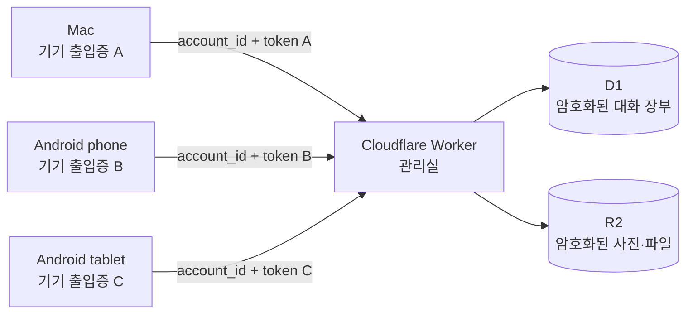
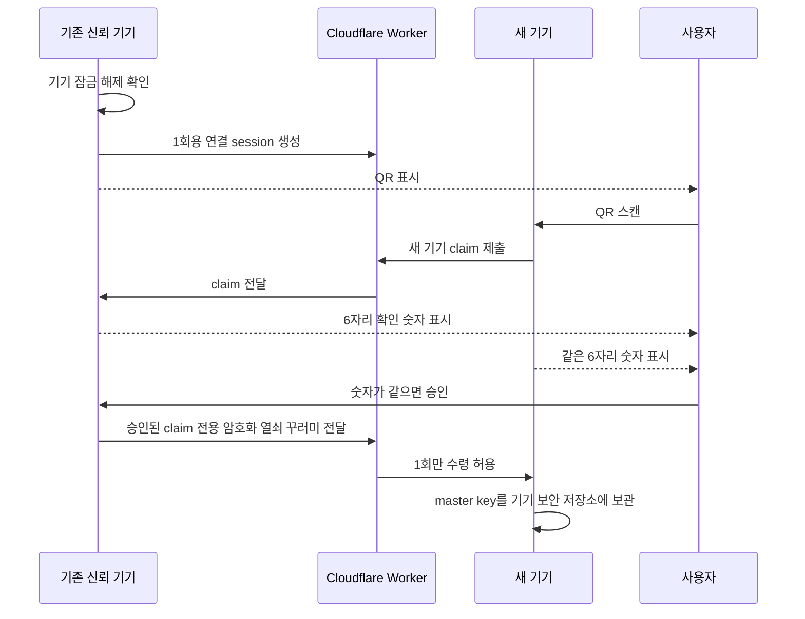
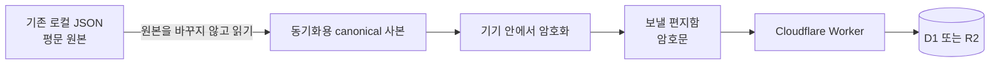
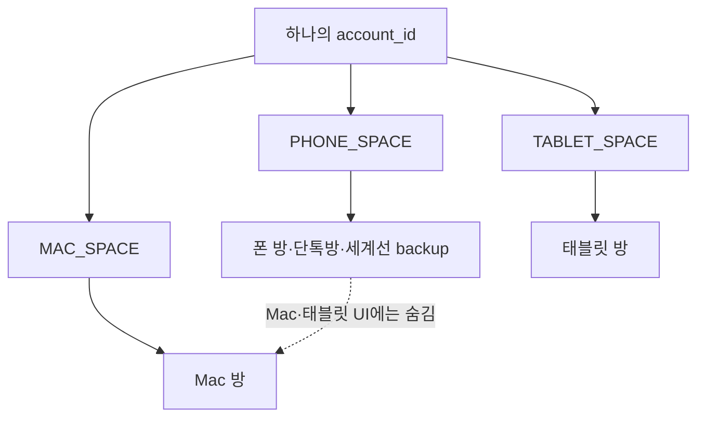
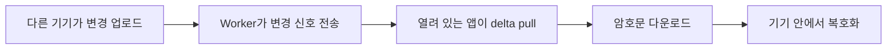
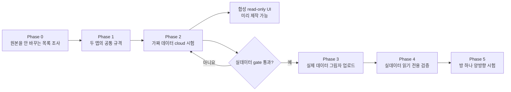

# 초보자를 위한 가가오독 기기 연결 설명서

_Mac·Android phone·Android tablet이 Cloudflare를 통해 연결되는 원리 · 2026-08-27_

---

> 💡 **그림 방식:** 이 문서의 그림은 GPT Image로 만든 그림이 아니라 **Mermaid 설계도**다. 글자와 화살표를 정확하게 고칠 수 있고 GitHub에서도 다시 그려지기 때문에 기술 설명에 더 알맞다.

## 🧠 한 문장으로 이해하기

세 기기는 같은 비밀번호를 서버에 보내서 연결되는 것이 아니다. **한 계정 번호 아래 각 기기 출입증을 발급받고, 같은 비밀 열쇠를 안전하게 나눠 가진 뒤**, 그 계정 번호가 붙은 암호화 상자만 주고받는다.

## 🏢 Cloudflare는 무엇을 하나요?

아파트 관리실에 비유하면 쉽다.

| 실제 이름 | 쉬운 비유 | 역할 |
| --- | --- | --- |
| Worker | 관리실 직원 | 기기 출입증을 확인하고 올바른 계정 자료만 전달 |
| D1 | 관리 장부·작은 보관함 | 방, 메시지 순서, 암호화된 글 같은 구조화된 자료 저장 |
| R2 | 큰 물품 창고 | 암호화된 사진·PDF 같은 큰 파일 저장 |
| `account_id` | 사물함 번호 | 세 기기가 어느 사용자 묶음인지 표시 |
| device token | 기기별 출입증 | 이 기기가 계정에 들어와도 되는지 증명 |
| `account_master_key` | 상자를 여는 비밀 열쇠 | 대화 내용을 기기 안에서 잠그고 푸는 데 사용 |
| 복구 문구 | 비상용 예비 열쇠 | 모든 기기를 잃었을 때 master key를 되찾는 수단 |

중요한 점은 **모든 기기가 같은 token을 쓰지 않는다는 것**이다. 계정 묶음은 같지만 출입증은 기기마다 다르다. 폰을 잃으면 폰 출입증만 폐기할 수 있고 Mac·태블릿은 계속 사용할 수 있다.

## 📱 QR로 어떻게 같은 계정이 되나요?

이미 연결된 기기 하나가 새 기기를 초대한다. Mac만 기준 기기일 필요는 없다. Mac·phone·tablet 중 **이미 신뢰받은 기기라면 어느 것이든 QR을 보여줄 수 있다.**

QR을 찍은 것만으로 바로 열쇠를 주지 않는다. 두 화면의 6자리 숫자가 같은지 사용자가 확인하고, 기존 기기가 **그 새 기기 요청을 승인한 뒤에만** 열쇠를 전달한다.

### 모든 기기를 잃었다면

QR을 보여줄 기존 기기가 없으므로 최초 설정 때 적어둔 12단어 복구 문구를 사용한다. 복구 문구까지 잃으면 Cloudflare에 암호문이 남아 있어도 풀 수 없다.

## 🔐 대화는 언제 잠기나요?

로컬 대화 파일을 통째로 암호화하는 것이 아니다. 현재 앱의 JSON은 그대로 유지하고 **클라우드로 보낼 사본만 기기 안에서 암호화**한다.

그래서 Cloudflare가 보는 것은 주로 다음과 같다.

- 어느 계정·공간·방의 자료인지
- 메시지 순서와 변경 번호
- 언제 변경됐는지
- 암호문의 크기와 첨부 object 크기
- 삭제 표시 같은 동기화 운영 정보

방 이름, persona, 요약, 메시지 본문, 사진·PDF 내용은 기기에서 잠가서 보낸다. 다만 현재 설계는 악의적인 서버가 옛 자료를 다시 보여주거나 거짓 삭제 표시를 넣는 것까지 완전히 증명하지는 못한다.

## 🗂️ 폰·Mac·태블릿 자료가 섞이지 않나요?

같은 계정 안에서도 `space_id`라는 칸으로 출처를 나눈다.

사용자가 정한 현재 정책은 다음과 같다.

- 폰 방은 cloud에 backup하지만 Mac·태블릿에는 보이지 않는다.
- 단톡방·세계선은 처음부터 canonical 구조에 포함하지만 phone 공간에 둔다.
- Mac 방은 초기에는 태블릿에 노출하지 않는다.
- 원격 탭에서는 새 방을 만들지 않고 기존 방만 이어간다.
- 호감도는 기기끼리 공유하지 않는다.
- Gemini cache도 기기별로 따로 유지한다.

## 🔔 “즉시 알림”은 어떤 뜻인가요?

현재 결정은 앱이 열려 있을 때만 실시간으로 “새 변경이 있다”는 신호를 받는 것이다. 카카오톡처럼 앱이 꺼진 상태에서 운영체제 알림을 보내는 FCM·APNs는 만들지 않는다.

신호 자체에는 대화 내용을 넣지 않는다. 연결이 끊겼다가 다시 열리면 마지막으로 받은 순번 이후의 변경을 다시 확인한다.

## 🧪 왜 바로 실제 대화를 올리지 않나요?

집을 이사하기 전에 짐 목록을 만들고, 복사본이 망가지지 않는지 시험하는 것과 같다.

- **Phase 0:** 파일 수·크기·첨부 최대값만 조사한다.
- **Phase 1:** Swift와 Kotlin이 같은 byte를 만드는지 확인한다.
- **Phase 2:** 가짜 대화로 Cloudflare를 시험한다.
- **Phase 3:** 모든 안전 gate를 통과한 뒤에만 실제 암호문을 올린다.
- **Phase 4:** 가짜 데이터 화면은 Phase 3 전에도 만들 수 있고, 실제 방 표시 검증은 Phase 3 뒤에 한다.
- **Phase 5:** 새 text-only test room 하나만 양방향으로 시험한다.

한 단계가 실패하면 다음으로 넘어가지 않는다.

## ❓ 자주 헷갈리는 질문

### Cloudflare DB가 하나면 모든 사용자 자료가 섞이나요?

물리적으로 같은 D1 database를 쓸 수는 있지만, 대화 관련 row는 `account_id`와 `space_id`로 구분한다. 기기·복구처럼 계정 전체에 해당하는 row는 `account_id`로 구분한다. Worker가 device token의 계정과 요청한 계정이 같은지 확인하지 못하면 요청을 거부해야 한다.

### Google 로그인이 없어도 되나요?

된다. Google 계정 대신 최초 기기가 만든 계정과 QR pairing이 연결 매개가 된다. 다만 모든 기기를 잃었을 때를 위해 복구 문구가 필요하다.

### QR 사진만 훔치면 대화를 볼 수 있나요?

QR을 본 사람은 연결 요청을 시도할 수 있다. 그래서 기존 기기의 잠금 해제, 양쪽 6자리 숫자 비교, 기존 기기의 claim 승인, 1회 수령을 모두 거친다. 사용자가 숫자 비교를 생략하면 안전성이 낮아진다.

### Cloudflare 직원은 아무것도 못 보나요?

대화 본문과 파일 내용은 E2EE 대상이라 평문으로 보기 어렵게 만든다. 하지만 계정·방 식별자, 순번, 시각, 크기, 삭제 표시 같은 운영 metadata는 일부 보인다.

### 폰을 잃으면 이미 저장된 대화도 안전한가요?

폰의 device token을 폐기하면 정상적인 추가 다운로드는 막을 수 있다. 하지만 잃어버린 폰 안에 이미 저장된 로컬 대화와 key는 원격으로 지울 수 없다. v1은 master key rotation도 지원하지 않는다.

### 왜 GPT Image로 그림을 만들지 않았나요?

GPT Image는 예쁜 비유 그림이나 발표용 삽화에 좋다. 이 문서는 `account_id`, token, 승인 순서처럼 **글자 하나와 화살표 방향이 중요한 기술 설명**이라 수정 가능하고 검증하기 쉬운 Mermaid를 사용했다. 원하면 이 설명을 바탕으로 별도의 한 장짜리 인포그래픽을 나중에 만들 수 있다.

## 📚 다음에 함께 볼 문서

- [사용자 결정 17개](CROSS_DEVICE_SYNC_USER_DECISIONS.md)
- [핵심 기술 합의문](CROSS_DEVICE_SYNC_AGREEMENT.md)
- [E2EE 2차 제안](2026-08-27-sync-encryption-proposal.md)
- [구현 위치 지도](SYNC_IMPLEMENTATION_SURFACE_MAP.md)
- [Phase 0 비파괴 계획](PHASE0_INVENTORY_PLAN.md)

현재 E2EE 2차 제안은 Claude Code의 독립 재검토 대기 상태다. 이 설명서는 이해를 돕는 자료이며 구현이나 실제 데이터 업로드 승인서가 아니다.
