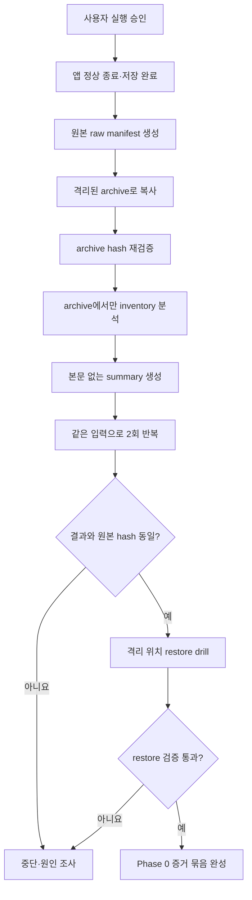

# Phase 0 비파괴 inventory 실행 계획

_실제 대화를 열기 전에 안전한 조사 절차를 고정하기 위한 계획 · 2026-08-27_

---

> ✅ **부분 실행 완료(2026-08-27):** 사용자 승인 아래 Mac과 Android phone의 archive·비파괴 inventory·restore drill을 완료했다. Tablet은 무선 디버깅 페어링까지 성공했지만 설치 앱이 non-debuggable이고 `allowBackup=false`라 내부 저장소 획득 단계에서 중단했다. 실제 대화의 cloud upload나 앱 데이터 변경은 하지 않았다. 결과는 [2026-08-27 Phase 0 조사 결과](2026-08-27-phase0-inventory-result.md)에 기록한다.

## 🎯 목적

Phase 0은 동기화를 시작하는 단계가 아니다. 다음 세 가지를 먼저 증명하는 단계다.

1. 어떤 데이터가 얼마나 있는지 **본문 없이 숫자만** 안다.
2. 조사 도구가 기존 파일을 한 글자도 바꾸지 않는다.
3. 문제가 생겼을 때 원본으로 돌아갈 수 있는 archive와 검증 절차가 있다.

## 🔒 절대 규칙

- Mac의 `loadMessagesForRoom(roomId:)`를 호출하지 않는다.
- Android의 `ChatStore.loadMessages(...)`와 `loadMessagesFresh(...)`를 호출하지 않는다.
- 앱의 typed model로 읽기 전에 raw byte hash를 만든다.
- 원본 디렉터리에는 archive, manifest, 임시 파일을 쓰지 않는다.
- 메시지 본문, persona 본문, 방 이름, 첨부 파일 이름, base64를 log나 report에 남기지 않는다.
- archive는 평문 대화가 들어 있는 민감 파일이므로 repository에 넣거나 commit하지 않는다.
- 원본 삭제·이동·rename·migration을 하지 않는다.

## 🗺️ 조사 대상

| 출처 | 논리적 위치 | 주요 파일 | 획득 시 주의점 |
| --- | --- | --- | --- |
| Mac | `~/Library/Application Support/KakaoSapiens` | `rooms_list.json`, `room_*_messages.json`, `room_*_digest.json`, avatar | 앱이 쓰는 중 복사하면 시점이 섞일 수 있다. 정상 종료와 pending save 완료 뒤 snapshot을 만든다. |
| Android phone | `context.filesDir/KakaoSapiens` | 위 파일 + group/worldline message·digest | release app 내부 파일은 desktop에서 바로 읽지 못할 수 있다. export 방식부터 승인받는다. |
| Android tablet | 별도 application id의 `context.filesDir/KakaoSapiens` | mentor room·message·digest·avatar | phone과 저장소가 다르므로 별도 source space로 수집한다. |

Android 획득은 다음 둘 중 하나를 나중에 선택한다.

- debug 가능 설치본에 한해 `run-as`로 읽기 전용 export
- 앱에 “진단 archive 내보내기” 기능을 별도 구현

둘 다 사용자 승인 전에는 실행하거나 구현하지 않는다. release 기기의 sandbox를 우회하는 방법은 사용하지 않는다.

## 🔄 전체 절차



## 🧱 두 번 나눠 조사하는 이유

### Pass A — JSON을 해석하지 않는 파일 조사

먼저 다음 값만 구한다.

- 상대 경로
- byte 크기
- 수정 시각
- SHA-256
- 파일 종류(message, digest, avatar, room list, worldline)
- 파일 이름에서 안전하게 추출 가능한 UUID와 source space

이 결과로 가장 큰 파일을 먼저 알아낸다. Mac 첨부에는 상한이 없으므로, 크기를 모른 채 모든 JSON을 메모리에 올리면 조사 도구 자체가 멈출 수 있다.

### Pass B — 복사본에서만 구조 조사

Pass A 결과로 안전한 parser 방식을 정한 뒤 archive를 분석한다.

- 작은 파일은 격리된 DTO decoder 사용 가능
- 큰 메시지 파일은 streaming JSON reader 사용
- base64는 decode하지 않고 문자열 길이와 padding으로 원래 byte 크기를 계산
- 본문 string은 내용에 접근하지 않고 길이만 세거나 완전히 건너뜀
- parser가 unknown field를 만나도 버리지 않고 field 이름 집합만 집계

Pass B가 실패해도 live source에는 영향이 없어야 한다.

## 📊 출력할 지표

### 파일과 공간

- source space별 raw 파일 수·총 byte·최대 파일 크기
- message, digest, avatar, worldline 파일 수
- hash manifest 누락·중복·읽기 실패 수
- group room 수와 worldline 수

### turn identity

- nil `turnId`가 하나라도 있는 파일 수
- non-null `turnId`가 하나라도 있는 파일 수
- nil과 non-null이 함께 있는 혼합 세대 파일 수
- 연속 AI 구간별 `distinctNonNullTurnIdCount`의 `0`·`1`·`2+` 분포
- nil이 있으면서 같은 AI 구간에 서로 다른 non-null turn ID가 2개 이상인 즉시 위험 파일 수
- `speakerRoomId`가 있는 파일 수
- AI 구간별 최대 인접 timestamp gap과 5초·30초·60초 초과 건수

Timestamp는 의심 구간을 줄이는 참고값일 뿐 훼손 판정 기준이 아니다. archive 대조 없이 `safe`나 `confirmed damaged`로 판정하지 않는다.

### 첨부와 avatar

- attachment 개수
- declared `fileSize` 분포
- base64 길이로 계산한 decoded byte 분포
- declared size와 계산 size 불일치 수
- 최대 attachment payload
- MIME type별 개수만 집계하고 파일 이름은 출력하지 않음
- avatar 개수·크기 분포·최대값

### schema와 compatibility

- room/message/digest에서 발견한 field 이름 집합
- Android 전용 field가 있는 파일 수
- decode 실패 수와 실패 category
- 기존 digest 존재 수와 `legacy_unversioned` 수
- group participant, reaction, heart change 참조 개수

## 🧾 report 형식

사람이 읽는 summary와 기계가 읽는 manifest를 분리한다.

```text
phase0-output/
├── inventory-summary.md       본문 없는 집계와 gate 판정
├── inventory-manifest.json    파일별 경로 category·size·mtime·hash
├── schema-summary.json        field 집합과 호환성 통계
├── risk-candidates.json       room/message UUID와 숫자만, 본문 없음
└── restore-report.json        격리 restore 검증 결과
```

민감한 archive 자체는 이 폴더와 repository 밖의 사용자 지정 위치에 둔다. `inventory-manifest.json`에도 방 이름과 attachment 파일 이름을 넣지 않는다.

## 🧪 비파괴성 acceptance test

| 검사 | 통과 조건 |
| --- | --- |
| live source 전후 hash | 모든 파일 SHA-256 동일 |
| live source 전후 byte | 크기 동일 |
| live source 전후 mtime | 동일 |
| 새 파일 | live source directory에 0개 |
| 반복 실행 | 같은 archive에서 summary·manifest 결과 동일 |
| parser 실패 | 원본·archive를 수정하지 않고 오류 report만 생성 |
| log 검사 | 본문·persona·방 이름·base64·복구 문구·API key 0건 |

파일 access time은 읽기만 해도 운영체제가 바꿀 수 있으므로 acceptance 대상으로 쓰지 않는다. byte, mtime, hash가 기준이다.

반복 실행 비교에서는 `run_id`와 실행 시각 같은 실행별 metadata를 제외한다. 같은 입력에서 계산된 파일·schema·위험 지표가 같은지를 비교한다.

## ♻️ restore와 rollback drill

Restore 검증은 live app directory에 덮어쓰지 않는다.

1. 새로운 임시 격리 directory를 만든다.
2. archive를 그곳에 풀고 manifest의 상대 경로를 재구성한다.
3. 모든 파일의 byte 크기와 SHA-256을 비교한다.
4. 원본과 restore 사본의 파일 집합이 정확히 같은지 확인한다.
5. 별도 test process에서 room list와 최소 fixture만 읽는다.
6. 검증이 끝난 임시 directory 삭제는 사용자 승인 또는 자동 생성 경로에 한해서만 수행한다.

실제 앱 directory로 restore하는 시험은 그보다 위험한 별도 단계다. Phase 0 첫 실행에는 포함하지 않는다.

## 🚦 실행 전 체크리스트

- [x] 사용자가 Mac·phone Phase 0 실행을 명시적으로 승인함
- [ ] Tablet의 non-debuggable·`allowBackup=false` 제약을 넘지 않는 획득 방법을 별도 승인함
- [x] archive 저장 위치와 권한을 정함
- [x] inventory tool source와 synthetic fixture를 먼저 작성함
- [x] 일반 app loader를 참조하지 않는 정적 검사를 통과함
- [x] synthetic fixture에서 비파괴성·본문 비출력 test를 통과함
- [x] Mac·phone archive와 격리 restore drill을 완료함

E2EE 독립 재검토는 Phase 3 전에 반드시 끝나야 하지만, 원본을 건드리지 않는 Phase 0 inventory 자체의 선행 조건은 아니다. 다만 재검토 결과로 inventory 지표가 바뀌면 report schema version을 올린다.

## ✅ Phase 0 완료 판정

다음을 모두 만족해야 Phase 0이 완료된다.

- 세 source space의 archive 또는 명시적인 제외 사유가 있다.
- raw manifest, inventory summary, restore report가 있다.
- live source의 byte·mtime·hash가 전후 동일하다.
- 실제 최대 attachment 크기가 확인되어 E2EE 첨부 상한 결정을 할 수 있다.
- legacy turn 상태를 `known safe`로 과장하지 않고 `preserved`, `suspected`, `unknown`으로 분류한다.
- 실패 항목이 있으면 Phase 1 설계 입력으로 기록하고 Phase 3을 계속 보류한다.

이 완료 판정도 **실데이터 cloud upload 승인과는 다르다.** Phase 3은 별도 사용자 지시와 모든 gate 통과가 필요하다.
