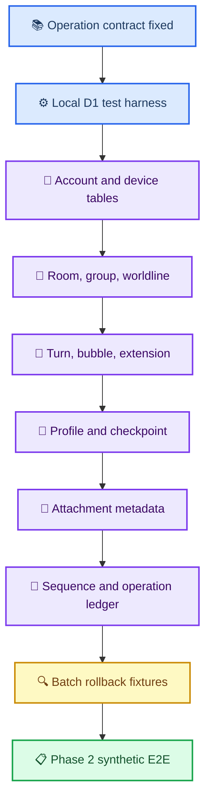

# Phase 1 D1 migration 선행 계획

_실제 DDL·Cloudflare resource를 만들기 전, local synthetic migration이 지켜야 할 순서와 acceptance 조건 — 2026-08-28_

---

## 📋 목적과 비범위

이 문서는 [canonical schema](PHASE1_CANONICAL_SCHEMA_DRAFT.md)와 [Worker API 초안](PHASE1_WORKER_API_DRAFT.md)을 실제 local D1 migration으로 옮길 때의 **작업 순서**를 정한다.

다음은 이 문서의 범위 밖이다.

- `CREATE TABLE` SQL 파일 작성
- Cloudflare D1·R2 resource 생성 또는 deploy
- 실제 대화·첨부·복구 문구 접근
- 앱 Swift·Kotlin persistence 변경
- production rollback 또는 기존 cloud data migration

Phase 1에는 real database가 없으므로 rollback은 **local synthetic test database를 폐기하고 migration을 처음부터 재적용하는 것**만 뜻한다. 실제 사용자 data가 생긴 뒤의 migration rollback은 별도 승인·backup·복구 계획이 필요하다.

## 🧭 구현 순서

## 💾 migration 단위와 불변식

| 순서 | logical migration | 포함 entity | 반드시 고정할 불변식 |
| ---: | --- | --- | --- |
| M00 | local test harness | migration loader, synthetic fixture | remote binding·deploy 없음, test file별 isolated storage |
| M01 | account boundary | `account`, `device` | 모든 business row가 `account_id` 아래에 있음; revoked device write 거부는 handler 단계 |
| M02 | conversation scope | `room`, `group_state`, `worldline` | `worldline_key`가 nullable `worldline_id`와 항상 일치, group/worldline은 `PHONE_SPACE` 전용 |
| M03 | turns and bubbles | `turn`, `bubble`, owner별 extension field table 3개 | scope-wide `bubble_order` unique, tombstone도 key·order를 보존, unknown extension byte 보존 |
| M04 | versioned AI state | `engine_profile`, `persona_snapshot`, `persona_snapshot_head`, `checkpoint` | immutable revision 행과 mutable head/checkpoint CAS 구분 |
| M05 | attachment metadata | `attachment` | `(account_id, attachment_id)`와 `(account_id, r2_object_key)` unique, allocated→uploaded→ready 상태 전이 |
| M06 | atomic write ledger | `operation_log`, `change_log`, transaction guard, account sequence | operation idempotency, account-wide `server_seq`, CAS failure 전체 rollback |

이 순서는 foreign key 사용 여부를 미리 결정하지 않는다. 미래 DDL은 각 table의 primary·unique·`CHECK` 조건을 **D1이 실제로 강제하는 fixture**로 증명한 뒤에만 reference constraint를 추가한다.

### 현재 구현·승인 상태

| 논리 단계 | 물리 migration | 근거 | 판정 |
| --- | --- | --- | --- |
| M00 | local migration loader | `def5260` | ✅ local-only harness 승인 |
| M01 | `0001_account_device.sql`, `0002_device_account_fk.sql` | `def5260`, `515c036` | ✅ account/device와 FK 승인 |
| M02 | `0003_conversation_scope.sql` | `381000f` | ✅ room/group_state/worldline 승인 |
| M03 | `0004_turn_bubble_extension.sql` | `8bd7f68`, `6bffb35` | ✅ turn/bubble/owner별 extension 승인 |
| M04 | 예정 `0005_versioned_ai_state.sql` | Claude preflight + Codex 통합 결정 | ⏳ 신규 table DDL·fixture 구현 |
| M05~M06 | 없음 | 구현 전 | ⏳ 선행 단계 이후 |

물리 파일 번호 `0002`는 논리 M02를 뜻하지 않는다. `0001`과 `0002`가 함께 논리 M01이고, 논리 M02는 물리 `0003`이다. M02 row의 nullable `server_seq` column은 canonical row shape이지만 값을 발급하지 않는다. `account.next_server_seq`와 실제 sequence 할당은 M06에만 추가한다.

D1 local probe에서는 `PRAGMA foreign_keys`가 `1`이며 `foreign_keys = OFF`와 `defer_foreign_keys = ON` 요청이 모두 무시됐다. 따라서 앞으로 rebuild가 필요한 migration은 PRAGMA로 제약을 끄거나 미루는 방식에 의존하지 않고, 항상 FK-valid한 copy/drop 순서로 설계한다. orphan row를 조용히 거르는 대신 migration 전체를 실패·rollback한다.

## 🔐 암호문과 schema의 경계

Worker와 D1은 content를 해석하지 않는다. migration은 다음만 저장한다.

| 종류 | D1 역할 | 금지 사항 |
| --- | --- | --- |
| 암호화 field | canonical path별 envelope base64 보존 | 평문 decode·JSON 재직렬화·unknown extension 제거 |
| 평문 identity | account·space·room·worldline·turn·message·attachment key | 다른 account의 identity를 같은 row에 결합 |
| 삭제 tombstone | identity·order·삭제 metadata 보존, encrypted content `NULL` | 삭제 content 유지·physical delete·order 재사용 |
| operation log | body fingerprint·결과 revision·server sequence | request body·ciphertext·token 기록 |

`relationship_policy`처럼 암호화된 engine profile field는 D1 constraint가 값을 검사하지 않는다. client가 복호화 후 값과 space 제약을 검사하고, Worker는 평문 entity·scope·권한만 검사한다. 이 분리는 Claude Code의 operation boundary 보정이 끝난 뒤 DDL contract에도 반영한다.

## 🔍 local migration acceptance fixture

다음 fixture는 합성 UUID·합성 envelope·본문 없는 sentinel만 사용한다.

| fixture | 통과 기준 |
| --- | --- |
| migration replay | 빈 local DB에서 전체 migration 적용 후 재적용해도 schema가 예측 가능하게 유지 |
| tenant isolation | 같은 room UUID라도 account가 다르면 충돌·조회·change log가 섞이지 않음 |
| null worldline | `worldline_id = null`은 D1에서 `worldline_key = ''`이고 UUID scope와 충돌하지 않음 |
| bubble uniqueness | active·tombstoned bubble 모두 scope-wide `bubble_order` unique 제약에 참여 |
| field patch | `set`과 `clear`가 같은 path에 동시에 오면 거부, unknown extension은 byte-identical 보존 |
| immutable revisions | persona/engine revision 행을 overwrite하지 않고 head/reference만 CAS로 전진 |
| CAS rollback | base revision mismatch 때 row·sequence·operation log·change log 모두 불변 |
| idempotent replay | 같은 operation ID와 fingerprint는 최초 결과, 다른 fingerprint는 mismatch |
| attachment lifecycle | account·state·size 제약을 벗어나면 R2 content endpoint가 아닌 metadata 단계에서 거부 |
| pull/bootstrap | stable key ordering, tombstone projection, crash 뒤 page 재적용 무해 |

## ⚠️ 단계별 migration 차단 조건

아래의 Worker 공통 선행 조건은 M00 시작 전에 필요했고 `e83bce1`로 통과했다. 나머지 항목은 모든 migration을 소급 차단하는 것이 아니라 해당 단계의 진입 gate다.

- [x] 최신 `@cloudflare/vitest-plugin` 기반 local Worker test stack 전환
- [x] operation별 `op`·`entity_type`·target shape·CAS 규칙 확정 (`e83bce1`)
- [x] initial runtime deletion gate를 validator가 실제로 거부
- [x] canonical Base64 decode→re-encode equality 보정 (`e83bce1`)
- [x] RFC 3339 UTC validator 보정
- [x] 후속 handler용 operation table read-only 재사용 경로 제공 (`e83bce1`)
- [x] M03: 논리 `extension_field`를 `room_extension_field`·`turn_extension_field`·`bubble_extension_field` 물리 table로 분리하고 각 owner composite FK 사용
- [x] M03: turn/bubble encrypted field·metadata와 named-worldline space를 operation table과 대조 (`8bd7f68`, `6bffb35`)
- [x] M04: immutable engine/persona revision, persona head CAS, mutable checkpoint CAS의 D1 경계 확정
- [x] M04: room exact-revision reference는 신규 1:1 `room_ai_state_ref`로 정규화해 기존 FK graph rebuild 회피
- [x] M04: 신규 table DDL·immutable trigger·local fixture 구현 (`3c462b5`)
- [ ] M04: operation별 metadata create/patch allowlist와 required/clear 규칙을 표 계약에 맞게 보정
- [ ] M05: R2 ciphertext 상한과 attachment metadata field 확정
- [ ] M05: 기존 bubble attachment reference에 account-scoped FK를 소급할지 확정하고, 추가한다면 bubble·bubble extension 동시 rebuild fixture 통과
- [ ] M06: revoked device write 거부와 exported operation table 재사용을 handler test로 증명

M03 preflight blocker에 대한 Codex 결정은 owner별 물리 table이다. table 자체가 owner type이므로 별도 discriminator가 없고, 각 primary key는 실제 owner identity와 `extension_key`로 구성하며 실제 composite FK를 둔다. M04의 persona extension은 `persona_snapshot` owner가 생길 때 별도 table로 추가한다. serialized owner key·identity blob·sentinel UUID·polymorphic FK는 사용하지 않는다.

### M04 단일 migration 순서

M04는 기존 table rebuild 없이 모두 신규 table로 구현한다. 물리 migration 하나에서 parent-before-child 순서를 사용한다.

1. `engine_profile`
2. `persona_snapshot`
3. `persona_snapshot_head`
4. `persona_snapshot_extension_field`
5. `checkpoint`
6. `room_ai_state_ref`

Engine/persona immutable table은 primary key revision을 `1...2^53-1`로 제한하고 UPDATE를 fail-closed로 거부한다. Persona head의 `current_snapshot_revision`이 CAS version이며 별도 head revision은 없다. Checkpoint는 mutable revision 0부터 시작하고 named-worldline PHONE-only·range pair·same-scope turn FK를 강제한다. `room_ai_state_ref`는 room PK를 그대로 PK/FK로 사용하고 engine/persona ID-revision pair의 all-null/all-non-null과 exact same-account/space FK를 강제한다.

### M05 bubble attachment FK rebuild gate

M03의 `bubble.attachment_ref_attachment_id`는 M05 attachment table보다 먼저 생기므로 현재 FK가 없다. M05에서 `(account_id, attachment_ref_attachment_id) → attachment(account_id, attachment_id)`를 소급한다면 D1이 FK disable/defer PRAGMA를 무시한다는 전제에서 다음 순서를 한 migration batch로 검증한다.

1. `attachment` table과 unique/index contract를 먼저 만든다.
2. 새 attachment FK를 포함한 staging bubble table을 만든다.
3. 기존 bubble을 명시 column list로 복사한다. non-null reference에 대응하는 attachment가 없으면 조용히 제거하지 않고 migration 전체를 실패시킨다.
4. 새 bubble을 parent로 참조하는 staging `bubble_extension_field`를 만들고 기존 extension row를 명시 column list로 복사한다.
5. 기존 child `bubble_extension_field`를 먼저 drop하고 기존 bubble을 나중에 drop한다.
6. staging bubble을 `bubble`로, staging child를 `bubble_extension_field`로 rename하고 원래 PK·unique·CHECK·FK를 모두 재검증한다.

필수 fixture는 attachment가 없는 null reference 보존, matching attachment reference 성공, dangling/cross-account reference 전체 rollback, bubble과 extension whole-row byte 동일성, tombstone·`bubble_order` unique 보존, staging table·ledger 잔여 없음이다. M05 구현 전에는 실제 FK 추가 여부를 최종 판정하지 않으며 placeholder parent row나 synthetic attachment metadata를 migration이 임의 생성하지 않는다.

## ✍️ 다음 구현 작업 분배

| 단계 | 담당 | 소유 범위 | 산출물 |
| --- | --- | --- | --- |
| M03 migration 재개 | Claude Code | `cloudflare/sync-worker/migrations/0004_*`, M03 focused test와 필요한 공용 migration expectation | turn·bubble·owner별 extension table schema commit |
| Phase 2 fixture·통합 문서 | Codex | Phase 2 plan, synthetic fixture/tool test, acceptance matrix와 이 plan | M00~M02 승인 반영·M03 gate 결정 |
| Integration review | Codex | Claude commit과 canonical docs의 위험 delta | M03 승인 또는 bounded 보정 지시 |

후속 migration 작업도 하나의 commit에 schema와 해당 local fixture만 담는다. 앱 코드, remote command, deploy, 실제 data 접근은 같은 작업에 섞지 않는다.

## 🔗 관련 문서

- [Phase 1 integration acceptance matrix](PHASE1_INTEGRATION_ACCEPTANCE_MATRIX.md)
- [canonical schema 통합 초안](PHASE1_CANONICAL_SCHEMA_DRAFT.md)
- [Worker API 초안](PHASE1_WORKER_API_DRAFT.md)
- [Worker scaffold Codex 검토](2026-08-28-phase1-worker-scaffold-codex-review.md)
- [Worker validator Codex 통합 검토](2026-08-28-phase1-worker-validator-codex-review.md)
- [사용자 결정 기록](CROSS_DEVICE_SYNC_USER_DECISIONS.md)
