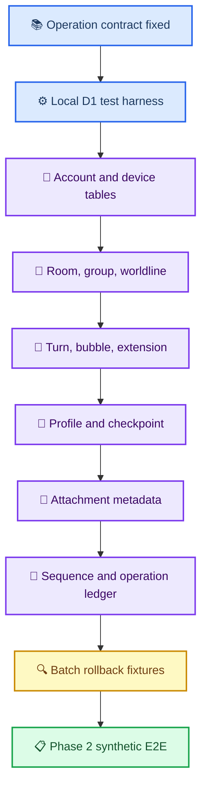

# Phase 1 D1 migration 선행 계획

_실제 DDL·Cloudflare resource를 만들기 전, local synthetic migration이 지켜야 할 순서와 acceptance 조건 — 2026-08-28_

---

## 📋 목적과 비범위

이 문서는 [canonical schema](PHASE1_CANONICAL_SCHEMA_DRAFT.md)와 [Worker API 초안](PHASE1_WORKER_API_DRAFT.md)을 실제 local D1 migration으로 옮길 때의 **작업 순서**를 정한다.

다음은 이 문서의 범위 밖이다.

- `CREATE TABLE` SQL 파일 작성
- Cloudflare D1·R2 resource 생성 또는 deploy
- 실제 대화·첨부·복구 문구 접근
- 앱 Swift·Kotlin persistence 변경
- production rollback 또는 기존 cloud data migration

Phase 1에는 real database가 없으므로 rollback은 **local synthetic test database를 폐기하고 migration을 처음부터 재적용하는 것**만 뜻한다. 실제 사용자 data가 생긴 뒤의 migration rollback은 별도 승인·backup·복구 계획이 필요하다.

## 🧭 구현 순서

## 💾 migration 단위와 불변식

| 순서 | logical migration | 포함 entity | 반드시 고정할 불변식 |
| ---: | --- | --- | --- |
| M00 | local test harness | migration loader, synthetic fixture | remote binding·deploy 없음, test file별 isolated storage |
| M01 | account boundary | `account`, `device` | 모든 business row가 `account_id` 아래에 있고 revoked device는 write 불가 |
| M02 | conversation scope | `room`, `group_state`, `worldline` | `worldline_key`가 nullable `worldline_id`와 항상 일치, group/worldline은 `PHONE_SPACE` 전용 |
| M03 | turns and bubbles | `turn`, `bubble`, `extension_field` | scope-wide `bubble_order` unique, tombstone도 key·order를 보존, unknown extension byte 보존 |
| M04 | versioned AI state | `engine_profile`, `persona_snapshot`, `persona_snapshot_head`, `checkpoint` | immutable revision 행과 mutable head/checkpoint CAS 구분 |
| M05 | attachment metadata | `attachment` | `(account_id, attachment_id)`와 `(account_id, r2_object_key)` unique, allocated→uploaded→ready 상태 전이 |
| M06 | atomic write ledger | `operation_log`, `change_log`, transaction guard, account sequence | operation idempotency, account-wide `server_seq`, CAS failure 전체 rollback |

이 순서는 foreign key 사용 여부를 미리 결정하지 않는다. 미래 DDL은 각 table의 primary·unique·`CHECK` 조건을 **D1이 실제로 강제하는 fixture**로 증명한 뒤에만 reference constraint를 추가한다.

## 🔐 암호문과 schema의 경계

Worker와 D1은 content를 해석하지 않는다. migration은 다음만 저장한다.

| 종류 | D1 역할 | 금지 사항 |
| --- | --- | --- |
| 암호화 field | canonical path별 envelope base64 보존 | 평문 decode·JSON 재직렬화·unknown extension 제거 |
| 평문 identity | account·space·room·worldline·turn·message·attachment key | 다른 account의 identity를 같은 row에 결합 |
| 삭제 tombstone | identity·order·삭제 metadata 보존, encrypted content `NULL` | 삭제 content 유지·physical delete·order 재사용 |
| operation log | body fingerprint·결과 revision·server sequence | request body·ciphertext·token 기록 |

`relationship_policy`처럼 암호화된 engine profile field는 D1 constraint가 값을 검사하지 않는다. client가 복호화 후 값과 space 제약을 검사하고, Worker는 평문 entity·scope·권한만 검사한다. 이 분리는 Claude Code의 operation boundary 보정이 끝난 뒤 DDL contract에도 반영한다.

## 🔍 local migration acceptance fixture

다음 fixture는 합성 UUID·합성 envelope·본문 없는 sentinel만 사용한다.

| fixture | 통과 기준 |
| --- | --- |
| migration replay | 빈 local DB에서 전체 migration 적용 후 재적용해도 schema가 예측 가능하게 유지 |
| tenant isolation | 같은 room UUID라도 account가 다르면 충돌·조회·change log가 섞이지 않음 |
| null worldline | `worldline_id = null`은 D1에서 `worldline_key = ''`이고 UUID scope와 충돌하지 않음 |
| bubble uniqueness | active·tombstoned bubble 모두 scope-wide `bubble_order` unique 제약에 참여 |
| field patch | `set`과 `clear`가 같은 path에 동시에 오면 거부, unknown extension은 byte-identical 보존 |
| immutable revisions | persona/engine revision 행을 overwrite하지 않고 head/reference만 CAS로 전진 |
| CAS rollback | base revision mismatch 때 row·sequence·operation log·change log 모두 불변 |
| idempotent replay | 같은 operation ID와 fingerprint는 최초 결과, 다른 fingerprint는 mismatch |
| attachment lifecycle | account·state·size 제약을 벗어나면 R2 content endpoint가 아닌 metadata 단계에서 거부 |
| pull/bootstrap | stable key ordering, tombstone projection, crash 뒤 page 재적용 무해 |

## ⚠️ migration 작성 전 차단 조건

다음 항목이 해결되기 전에는 `cloudflare/sync-worker/migrations/`를 만들지 않는다.

- [x] 최신 `@cloudflare/vitest-plugin` 기반 local Worker test stack 전환
- [ ] operation별 `op`·`entity_type`·target shape·CAS 규칙 확정 (`group_state.worldline_id` 제거만 남음)
- [x] initial runtime deletion gate를 validator가 실제로 거부
- [ ] canonical Base64 decode→re-encode equality 보정
- [x] RFC 3339 UTC validator 보정
- [ ] 후속 handler용 operation table read-only 재사용 경로 제공
- [ ] encrypted field와 metadata column 목록을 operation table과 대조
- [ ] R2 ciphertext 상한과 attachment metadata field 확정

이 조건들은 [Worker scaffold 통합 검토](2026-08-28-phase1-worker-scaffold-codex-review.md)의 차단 사항과 동일하다. 먼저 HTTP boundary를 고정해야 D1 table이 존재하지 않는 field를 영구 column으로 만들지 않는다.

## ✍️ 다음 구현 작업 분배

| 단계 | 담당 | 소유 범위 | 산출물 |
| --- | --- | --- | --- |
| Worker contract stabilization | Claude Code | `cloudflare/sync-worker/`, Worker API operation shape | 최신 test stack·validator·negative tests |
| D1 migration implementation | 후속으로 별도 배정 | `cloudflare/sync-worker/migrations/`, migration test | local-only DDL·fixture·rollback evidence |
| Integration review | Codex | acceptance matrix·migration plan·commit review | Phase 2 진입 여부 판정 |

후속 migration 작업도 하나의 commit에 schema와 해당 local fixture만 담는다. 앱 코드, remote command, deploy, 실제 data 접근은 같은 작업에 섞지 않는다.

## 🔗 관련 문서

- [Phase 1 integration acceptance matrix](PHASE1_INTEGRATION_ACCEPTANCE_MATRIX.md)
- [canonical schema 통합 초안](PHASE1_CANONICAL_SCHEMA_DRAFT.md)
- [Worker API 초안](PHASE1_WORKER_API_DRAFT.md)
- [Worker scaffold Codex 검토](2026-08-28-phase1-worker-scaffold-codex-review.md)
- [Worker validator Codex 통합 검토](2026-08-28-phase1-worker-validator-codex-review.md)
- [사용자 결정 기록](CROSS_DEVICE_SYNC_USER_DECISIONS.md)
