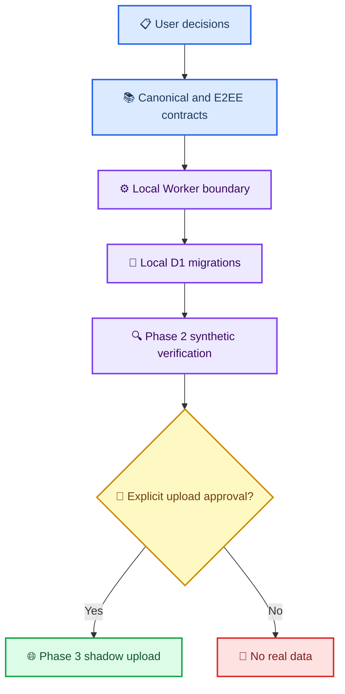

# Phase 1 동기화 통합 acceptance matrix

_가가오독 크로스 디바이스 동기화의 문서 계약·fixture·local 구현 상태를 한 곳에서 대조하는 기준표 — 2026-08-28_

---

## 📋 목적과 범위

이 문서는 “무엇이 문서로 합의됐는가”와 “무엇이 실제로 local test를 통과했는가”를 구분한다. 체크 표시가 있어도 Cloudflare 배포, 앱 networking, 실제 대화 업로드가 승인됐다는 뜻은 아니다.

상태 표기:

| 상태 | 의미 |
| --- | --- |
| ✅ 계약·검증 있음 | 문서 계약과 해당 fixture 또는 local test가 존재 |
| 🟡 계약만 있음 | 문서로는 정했지만 구현·실행 검증이 없음 |
| 🔴 차단 | 후속 단계를 진행하면 계약이 깨질 수 있음 |
| ⏳ 후속 단계 | 선행 gate가 끝난 뒤에만 수행 |

## 🧭 단계 의존 관계

## ✅ 현재 기준표

| 경계 | 현재 근거 | 상태 | 다음 gate |
| --- | --- | --- | --- |
| 제품 방향·공개 범위 | [사용자 결정 17개](CROSS_DEVICE_SYNC_USER_DECISIONS.md) | ✅ | 구현은 별도 승인 필요 |
| identity·`worldline_id`·`bubble_order` | [canonical schema](PHASE1_CANONICAL_SCHEMA_DRAFT.md), Python contract fixture | ✅ | local D1 제약 test |
| legacy turn·비파괴 조사 | [Phase 0 계획](PHASE0_INVENTORY_PLAN.md), inventory tool·집계 보고서 | ✅ | 합성 importer test |
| E2EE key·AAD·pairing 계약 | [E2EE 제안서](2026-08-27-sync-encryption-proposal.md), vector test | ✅ | 앱 onboarding UI |
| canonical field ownership·extension | canonical schema, Python contract fixture | ✅ | D1 field·extension row 구현 |
| Worker health·기본 boundary | `2fa06b3`의 local Worker 71 tests | ✅ | D1 연결 뒤 health 회귀 test |
| operation target·field envelope 검사 | `e83bce1`, [Worker validator 통합 검토](2026-08-28-phase1-worker-validator-codex-review.md) | ✅ | handler가 exported operation table 재사용 |
| M00~M02 local D1 schema | `def5260`, `515c036`, `381000f` | ✅ | M03 owner별 extension table 구현 |
| M03 turn·bubble·extension schema | `8bd7f68`, `6bffb35` | ✅ | M04 versioned AI state preflight |
| M04 versioned AI state contract | `3c462b5`, `b2a93c6` DDL·metadata validator·320 tests | ✅ | M05 attachment migration |
| M05 attachment persistence | `5299b27` DDL·validator·bubble FK rebuild, Codex focused 50 tests 중 M05 포함 | ✅ | M06 ledger 뒤 local R2 endpoint |
| Device token auth boundary | `fa49ed1` canonical token/hash/revoked local boundary, Codex focused auth review | ✅ | M06 handler·attachment route에 연결 |
| M06 ledger DDL | `d33ee67`, `4a8bf26`; Codex focused 45 tests | ✅ | operation handler atomic batch |
| patch_room atomic handler | `8d7a8fd`, `f712c8e`, `62a83f4`; Codex focused 212 tests | ✅ | create_room과 나머지 operation family 확장 |
| create_room atomic handler | `2b456a3`; Codex focused room-family 228 tests | ✅ | group_state/worldline family 확장 |
| group_state/worldline atomic handlers | `37e408c`, `f8e766b`, `06d401e`; Codex focused 41 tests | ✅ | versioned AI state family preflight |
| versioned AI state atomic handlers | `f7195f3`, `da5b201`, `b69d8ee`, `04c9197`; Codex focused 222 tests | ✅ | turn/bubble family preflight |
| turn/bubble atomic handlers | `2875ef4`, `7328825`, `60594d8`; Codex focused 64 tests | ✅ | create_attachment handler·route preflight |
| attachment atomic handler | `ea731c7`; Codex focused 249 tests | ✅ | operation HTTP route envelope |
| D1 transaction·CAS·idempotency | `0008` ledger와 runtime-enabled operation 15개 atomic handler | ✅ | HTTP route와 Phase 2 다중 isolate 합성 검증 |
| operation HTTP route | `d71d5eb`, `981490b`; Codex focused 20 tests | ✅ | local R2 attachment routes |
| local R2 attachment family | `849d399`, `6d054af`, `8a6117c`, `45e0824`; Codex focused 122 tests | ✅ | changes/bootstrap projection |
| R2 attachment state machine | `5299b27`, `849d399`, `6d054af`, `8a6117c`, `45e0824` local lifecycle | ✅ | Phase 2 연결 E2E |
| Android phone attachment entry | `0b6d318`, `f5a87da` | ✅ | M05 이후 cross-device upload 연결; release 실기기 방향 재확인 |
| pull·bootstrap·cursor | `5a05efa`, `f289df5`, `84acc8c`; Codex focused 76 tests | ✅ | Phase 2 연결 E2E |
| Phase 2 local synthetic E2E | `7cdeabe`, `5c54400`, `9c2827d`; Worker·D1·R2 recovery·비노출 | ✅ | pairing·recovery와 client outbox |
| Swift·Kotlin field E2EE fixed vector | `d9a2ac0`, `a0dd551`, `cd0999d`; 공용 artifact exact bytes | ✅ | 키 보관·pairing·recovery |
| pairing·recovery persistence·HTTP | `0331043`, `82706f6`, `2711ddc`, `739b6ab`; enrollment/recovery/session/claim D1·route | ✅ | rate limit·expiry cleanup |
| 앱 device-local key custody | `3dd2635`; macOS ThisDeviceOnly Keychain, Android non-exportable Keystore wrapping | ✅ | onboarding UI·실제 client 연결 |
| 앱 durable outbox | `325a2cf`; 양 플랫폼 exact raw-body atomic journal·restart test | ✅ | 기존 local mutation 연결·HTTP drain |
| HTTP rate limiting | `0010_rate_limit.sql`; keyed subject·atomic budget local test | ✅ | remote `RATE_LIMIT_MAC_KEY` secret 주입 |
| 앱 remote UI | canonical 계약만 존재 | ⏳ | local client networking 뒤 구현 |
| Phase 3 실제 data shadow upload | 사용자 별도 승인 없음 | ⏳ | Phase 0~2 gate 및 명시 승인 |

## 🔍 Phase 1 통합 gate

Phase 1을 “계약·local boundary가 구현 가능한 상태”라고 판정하려면 아래 항목이 모두 필요하다.

### Worker HTTP boundary

- [x] `@cloudflare/vitest-plugin` + Vitest 4.1 이상으로 local test stack 전환
- [x] operation별 `op`·`entity_type`·target ID·revision 규칙을 table-driven validator로 고정
- [x] 초기 runtime에서 `delete_turn`·`delete_bubble` 거부
- [x] 평문 top-level `relationship_policy` 제거
- [x] canonical Base64를 decode→re-encode equality까지 검사 (`e83bce1`)
- [x] 실제 RFC 3339 UTC 날짜·시간 값 검사
- [x] 기존 health·content-free error·배포 방지 test 유지
- [x] `group_state` target에서 `worldline_id`를 금지 (`e83bce1`)
- [x] 후속 handler가 operation table을 복제하지 않도록 read-only 재사용 경로 제공 (`e83bce1`)
- [x] canonical device token parse·hash lookup·revoked 거부 경계 (`fa49ed1`)

### D1 persistence boundary

- [x] M00 harness와 M01 account/device·FK local migration (`def5260`, `515c036`)
- [x] M02 room·group_state·worldline primary·FK·`CHECK` contract (`381000f`)
- [x] `worldline_key = COALESCE(worldline_id, '')` 일치 test (`381000f`)
- [x] tombstone 행이 identity·`bubble_order`를 계속 보존하는 test (`7328825`)
- [x] CAS failure가 canonical row·sequence·operation/change log 전체를 rollback하는 test (`f712c8e` 외 family별 transaction spec)
- [x] idempotent replay가 sequence를 추가 소비하지 않는 test (M06 family별 transaction spec)
- [x] M01·M02 tenant/account 경계를 D1 FK로 강제
- [x] M05 attachment DDL·bubble account-scoped FK rebuild (`5299b27`)
- [x] M06 account sequence·operation/change ledger·transaction guard DDL (`4a8bf26`)
- [x] patch_room CAS failure·replay·revoked·cross-space write의 전체 rollback (`f712c8e`, `62a83f4`)
- [x] attachment state transition test (`849d399`, `8a6117c`, `45e0824`)

### Integration evidence

- [x] Swift·Kotlin E2EE fixed vector 교차 복호화 (`d9a2ac0`, `a0dd551`, `cd0999d`)
- [x] local Worker + local D1 + local R2 synthetic end-to-end test (`7cdeabe`)
- [x] request·error·metric에서 content/token/ciphertext가 새지 않는 test (`5c54400`)
- [x] 실데이터 없이 fixture만 사용했다는 commit-level 확인 (`7cdeabe`, `5c54400`)
- [x] 최초 enrollment·recovery·pairing local HTTP와 secret 비노출 회귀 (`82706f6`, `2711ddc`, `739b6ab`)
- [x] 양 플랫폼 master key·device token의 device-local custody 경계 (`3dd2635`)
- [x] 같은 operation retry가 최초 raw bytes를 재사용하는 durable outbox (`325a2cf`)

## ⚠️ 지금 하면 안 되는 일

- Cloudflare account 로그인, D1·R2 생성, deploy 또는 `--remote` migration
- 실제 대화 archive·첨부·복구 문구를 test fixture로 복사
- Worker의 opaque ciphertext를 복호화하거나 분석하기
- Phase 3 shadow upload 또는 Phase 5 양방향 write 활성화

## ✍️ 소유 경계

| 담당 | 현재 소유 범위 | 완료 산출물 |
| --- | --- | --- |
| Claude Code | 완료된 `cloudflare/sync-worker/` runtime과 Phase 2 local E2E | operation·R2·changes/bootstrap·synthetic recovery tests |
| Codex | canonical docs, 공용 crypto artifact, Swift·Kotlin client crypto와 후속 local integration | fixed-vector 통합 판정과 pairing·outbox·remote UI gate |
| 사용자 | 실제 데이터 접근·원격 resource 생성·업로드 승인 | 별도 명시 지시 |

M03~M06, operation·attachment·pairing·recovery HTTP route, local R2 lifecycle,
changes/bootstrap, Phase 2 local synthetic E2E, 양 플랫폼 E2EE·device-local key
custody·durable outbox까지 local 통합 승인됐다. 다음 gate는 client networking·remote
UI와 rate limit·expiry/orphan cleanup 같은 운영 안전 경계이며, remote Cloudflare
resource와 실제 data는 계속 금지한다.

## 🔗 관련 문서

- [사용자 결정 기록](CROSS_DEVICE_SYNC_USER_DECISIONS.md)
- [기술 합의문](CROSS_DEVICE_SYNC_AGREEMENT.md)
- [canonical schema 통합 초안](PHASE1_CANONICAL_SCHEMA_DRAFT.md)
- [Worker API 초안](PHASE1_WORKER_API_DRAFT.md)
- [Worker scaffold Codex 검토](2026-08-28-phase1-worker-scaffold-codex-review.md)
- [Worker validator Codex 통합 검토](2026-08-28-phase1-worker-validator-codex-review.md)
- [D1 migration 선행 계획](PHASE1_D1_MIGRATION_PLAN.md)
