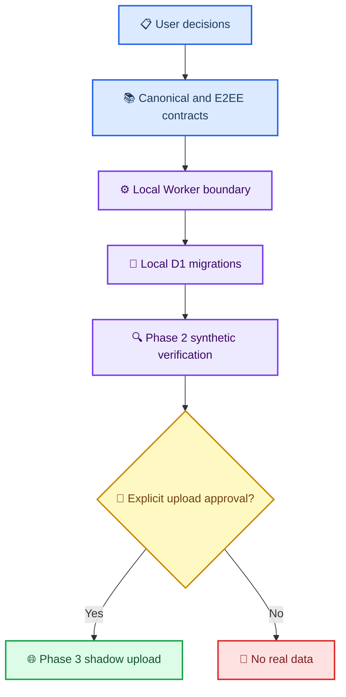

# Phase 1 동기화 통합 acceptance matrix

_가가오독 크로스 디바이스 동기화의 문서 계약·fixture·local 구현 상태를 한 곳에서 대조하는 기준표 — 2026-08-28_

---

## 📋 목적과 범위

이 문서는 “무엇이 문서로 합의됐는가”와 “무엇이 실제로 local test를 통과했는가”를 구분한다. 체크 표시가 있어도 Cloudflare 배포, 앱 networking, 실제 대화 업로드가 승인됐다는 뜻은 아니다.

상태 표기:

| 상태 | 의미 |
| --- | --- |
| ✅ 계약·검증 있음 | 문서 계약과 해당 fixture 또는 local test가 존재 |
| 🟡 계약만 있음 | 문서로는 정했지만 구현·실행 검증이 없음 |
| 🔴 차단 | 후속 단계를 진행하면 계약이 깨질 수 있음 |
| ⏳ 후속 단계 | 선행 gate가 끝난 뒤에만 수행 |

## 🧭 단계 의존 관계

## ✅ 현재 기준표

| 경계 | 현재 근거 | 상태 | 다음 gate |
| --- | --- | --- | --- |
| 제품 방향·공개 범위 | [사용자 결정 17개](CROSS_DEVICE_SYNC_USER_DECISIONS.md) | ✅ | 구현은 별도 승인 필요 |
| identity·`worldline_id`·`bubble_order` | [canonical schema](PHASE1_CANONICAL_SCHEMA_DRAFT.md), Python contract fixture | ✅ | local D1 제약 test |
| legacy turn·비파괴 조사 | [Phase 0 계획](PHASE0_INVENTORY_PLAN.md), inventory tool·집계 보고서 | ✅ | 합성 importer test |
| E2EE key·AAD·pairing 계약 | [E2EE 제안서](2026-08-27-sync-encryption-proposal.md), vector test | ✅ | Worker pairing endpoint test |
| canonical field ownership·extension | canonical schema, Python contract fixture | ✅ | D1 field·extension row 구현 |
| Worker health·기본 boundary | `7044ffc`의 local Worker 40 tests | 🟡 | 차단 사항 보정 후 재검증 |
| operation target·field envelope 검사 | [Worker scaffold 검토](2026-08-28-phase1-worker-scaffold-codex-review.md) | 🔴 | Claude Code가 validator·API 초안 보정 |
| D1 transaction·CAS·idempotency | [Worker API 초안](PHASE1_WORKER_API_DRAFT.md) | 🟡 | migration + local D1 batch test |
| R2 attachment state machine | Worker API 초안 | 🟡 | encrypted size·local R2 test |
| pull·bootstrap·cursor | Worker API 초안 | 🟡 | local pagination/crash fixture |
| 앱 durable outbox·remote UI | canonical schema의 계약만 존재 | ⏳ | Worker·D1 synthetic test 통과 뒤 |
| Phase 3 실제 data shadow upload | 사용자 별도 승인 없음 | ⏳ | Phase 0~2 gate 및 명시 승인 |

## 🔍 Phase 1 통합 gate

Phase 1을 “계약·local boundary가 구현 가능한 상태”라고 판정하려면 아래 항목이 모두 필요하다.

### Worker HTTP boundary

- [ ] `@cloudflare/vitest-plugin` + Vitest 4.1 이상으로 local test stack 전환
- [ ] operation별 `op`·`entity_type`·target ID·revision 규칙을 table-driven validator로 고정
- [ ] 초기 runtime에서 `delete_turn`·`delete_bubble` 거부
- [ ] 평문 top-level `relationship_policy` 제거
- [ ] canonical Base64 envelope와 실제 RFC 3339 UTC 값 검사
- [ ] 기존 health·content-free error·배포 방지 test 유지

### D1 persistence boundary

- [ ] migration 순서와 table별 primary·unique·`CHECK` contract 확정
- [ ] `worldline_key = COALESCE(worldline_id, '')` 일치 test
- [ ] tombstone 행이 identity·`bubble_order`를 계속 보존하는 test
- [ ] CAS failure가 canonical row·sequence·operation/change log 전체를 rollback하는 test
- [ ] idempotent replay가 sequence를 추가 소비하지 않는 test
- [ ] tenant/account 경계와 attachment state transition test

### Integration evidence

- [ ] Swift·Kotlin E2EE fixed vector 교차 복호화
- [ ] local Worker + local D1 + local R2 synthetic end-to-end test
- [ ] request·error·metric에서 content/token/ciphertext가 새지 않는 test
- [ ] 실데이터 없이 fixture만 사용했다는 commit-level 확인

## ⚠️ 지금 하면 안 되는 일

- Cloudflare account 로그인, D1·R2 생성, deploy 또는 `--remote` migration
- 실제 대화 archive·첨부·복구 문구를 test fixture로 복사
- Worker의 opaque ciphertext를 복호화하거나 분석하기
- Phase 3 shadow upload 또는 Phase 5 양방향 write 활성화

## ✍️ 소유 경계

| 담당 | 현재 소유 범위 | 완료 산출물 |
| --- | --- | --- |
| Claude Code | `cloudflare/sync-worker/`, Worker API operation shape, relationship policy 경계, `.gitignore`의 `node_modules/` | validator 보정 커밋과 local test 결과 |
| Codex | 이 matrix, [D1 migration plan](PHASE1_D1_MIGRATION_PLAN.md), 통합 판정 | D1 구현 선행 조건·acceptance 기준·다음 작업 분배 |
| 사용자 | 실제 데이터 접근·원격 resource 생성·업로드 승인 | 별도 명시 지시 |

Claude Code의 다음 커밋이 도착하면 Codex는 이 표의 🔴·🟡 항목을 다시 대조하고, 통과한 것만 ✅로 바꾼다.

## 🔗 관련 문서

- [사용자 결정 기록](CROSS_DEVICE_SYNC_USER_DECISIONS.md)
- [기술 합의문](CROSS_DEVICE_SYNC_AGREEMENT.md)
- [canonical schema 통합 초안](PHASE1_CANONICAL_SCHEMA_DRAFT.md)
- [Worker API 초안](PHASE1_WORKER_API_DRAFT.md)
- [Worker scaffold Codex 검토](2026-08-28-phase1-worker-scaffold-codex-review.md)
- [D1 migration 선행 계획](PHASE1_D1_MIGRATION_PLAN.md)
