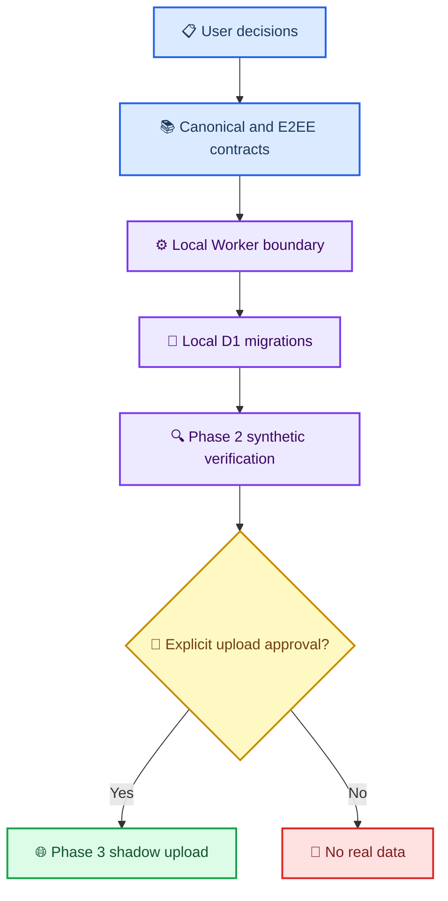

# Phase 1 동기화 통합 acceptance matrix

_가가오독 크로스 디바이스 동기화의 문서 계약·fixture·local 구현 상태를 한 곳에서 대조하는 기준표 — 2026-08-28_

---

## 📋 목적과 범위

이 문서는 “무엇이 문서로 합의됐는가”와 “무엇이 실제로 local test를 통과했는가”를 구분한다. 체크 표시가 있어도 Cloudflare 배포, 앱 networking, 실제 대화 업로드가 승인됐다는 뜻은 아니다.

상태 표기:

| 상태 | 의미 |
| --- | --- |
| ✅ 계약·검증 있음 | 문서 계약과 해당 fixture 또는 local test가 존재 |
| 🟡 계약만 있음 | 문서로는 정했지만 구현·실행 검증이 없음 |
| 🔴 차단 | 후속 단계를 진행하면 계약이 깨질 수 있음 |
| ⏳ 후속 단계 | 선행 gate가 끝난 뒤에만 수행 |

## 🧭 단계 의존 관계

## ✅ 현재 기준표

| 경계 | 현재 근거 | 상태 | 다음 gate |
| --- | --- | --- | --- |
| 제품 방향·공개 범위 | [사용자 결정 17개](CROSS_DEVICE_SYNC_USER_DECISIONS.md) | ✅ | 구현은 별도 승인 필요 |
| identity·`worldline_id`·`bubble_order` | [canonical schema](PHASE1_CANONICAL_SCHEMA_DRAFT.md), Python contract fixture | ✅ | local D1 제약 test |
| legacy turn·비파괴 조사 | [Phase 0 계획](PHASE0_INVENTORY_PLAN.md), inventory tool·집계 보고서 | ✅ | 합성 importer test |
| E2EE key·AAD·pairing 계약 | [E2EE 제안서](2026-08-27-sync-encryption-proposal.md), vector test | ✅ | 앱 onboarding UI |
| canonical field ownership·extension | canonical schema, Python contract fixture | ✅ | D1 field·extension row 구현 |
| Worker health·기본 boundary | `2fa06b3`의 local Worker 71 tests | ✅ | D1 연결 뒤 health 회귀 test |
| operation target·field envelope 검사 | `e83bce1`, [Worker validator 통합 검토](2026-08-28-phase1-worker-validator-codex-review.md) | ✅ | handler가 exported operation table 재사용 |
| M00~M02 local D1 schema | `def5260`, `515c036`, `381000f` | ✅ | M03 owner별 extension table 구현 |
| M03 turn·bubble·extension schema | `8bd7f68`, `6bffb35` | ✅ | M04 versioned AI state preflight |
| M04 versioned AI state contract | `3c462b5`, `b2a93c6` DDL·metadata validator·320 tests | ✅ | M05 attachment migration |
| M05 attachment persistence | `5299b27` DDL·validator·bubble FK rebuild, Codex focused 50 tests 중 M05 포함 | ✅ | M06 ledger 뒤 local R2 endpoint |
| Device token auth boundary | `fa49ed1` canonical token/hash/revoked local boundary, Codex focused auth review | ✅ | M06 handler·attachment route에 연결 |
| M06 ledger DDL | `d33ee67`, `4a8bf26`; Codex focused 45 tests | ✅ | operation handler atomic batch |
| patch_room atomic handler | `8d7a8fd`, `f712c8e`, `62a83f4`; Codex focused 212 tests | ✅ | create_room과 나머지 operation family 확장 |
| create_room atomic handler | `2b456a3`; Codex focused room-family 228 tests | ✅ | group_state/worldline family 확장 |
| group_state/worldline atomic handlers | `37e408c`, `f8e766b`, `06d401e`; Codex focused 41 tests | ✅ | versioned AI state family preflight |
| versioned AI state atomic handlers | `f7195f3`, `da5b201`, `b69d8ee`, `04c9197`; Codex focused 222 tests | ✅ | turn/bubble family preflight |
| turn/bubble atomic handlers | `2875ef4`, `7328825`, `60594d8`; Codex focused 64 tests | ✅ | create_attachment handler·route preflight |
| attachment atomic handler | `ea731c7`; Codex focused 249 tests | ✅ | operation HTTP route envelope |
| D1 transaction·CAS·idempotency | `0008` ledger와 runtime-enabled operation 15개 atomic handler | ✅ | HTTP route와 Phase 2 다중 isolate 합성 검증 |
| operation HTTP route | `d71d5eb`, `981490b`; Codex focused 20 tests | ✅ | local R2 attachment routes |
| local R2 attachment family | `849d399`, `6d054af`, `8a6117c`, `45e0824`; Codex focused 122 tests | ✅ | changes/bootstrap projection |
| R2 attachment state machine | `5299b27`, `849d399`, `6d054af`, `8a6117c`, `45e0824` local lifecycle | ✅ | Phase 2 연결 E2E |
| Android phone attachment entry | `0b6d318`, `f5a87da` | ✅ | M05 이후 cross-device upload 연결; release 실기기 방향 재확인 |
| pull·bootstrap·cursor | `5a05efa`, `f289df5`, `84acc8c`; Codex focused 76 tests | ✅ | Phase 2 연결 E2E |
| Phase 2 local synthetic E2E | `7cdeabe`, `5c54400`, `9c2827d`; Worker·D1·R2 recovery·비노출 | ✅ | pairing·recovery와 client outbox |
| Swift·Kotlin field E2EE fixed vector | `d9a2ac0`, `a0dd551`, `cd0999d`; 공용 artifact exact bytes | ✅ | 키 보관·pairing·recovery |
| pairing·recovery persistence·HTTP | `0331043`, `82706f6`, `2711ddc`, `739b6ab`; enrollment/recovery/session/claim D1·route | ✅ | rate limit·expiry cleanup |
| 앱 device-local key custody | `3dd2635`; macOS ThisDeviceOnly Keychain, Android non-exportable Keystore wrapping | ✅ | onboarding UI·실제 client 연결 |
| 앱 durable outbox | `325a2cf`; 양 플랫폼 exact raw-body atomic journal·restart test | ✅ | 기존 local mutation 연결·HTTP drain |
| 앱 Worker client·연결 상태 | `9365258`, `4a824cd`; HTTPS·device auth·기본 비활성·enrollment exact-byte journal | ✅ | onboarding UI와 사용자 활성화 |
| 앱 remote shadow replica | `eb348e8`; 양 플랫폼 opaque projection atomic store·원본 불변 회귀 | ✅ | 합성 page coordinator 연결 |
| HTTP rate limiting | `0010_rate_limit.sql`; local test와 원격 `pairing_redeem` 경계 실측(10 통과·11번째 `429`·타 scope 무영향) | ✅ | 앱 client의 backoff 정책 |
| orphan·expiry maintenance | local test와 원격 cron 실측; 보존·`allocated→abandoned`·pairing child-first 확인. 유예 초과 orphan 삭제는 R2 업로드 시각을 조작할 수 없어 원격 근거 없음 | ⚠️ | 24시간 뒤 orphan 삭제 원격 확인 |
| 원격 합성 Cloudflare 환경 | `184bd2b`, `624b556`, `803a0a8`; 합성 전용 D1·private R2·Worker, migration 0001~0010, 원격 smoke 46 검사 | ✅ | 합성 계정 onboarding coordinator |
| 원격 독립 요청 경합 | 별도 프로세스 2개의 CAS·`bubble_order`·replay 경합. 다중 isolate 여부는 관측 불가라 주장하지 않음 | ✅ | 부하 조건에서의 재확인 |
| 앱 onboarding coordinator | `95587b2`, `45b8935`; 양 플랫폼 enrollment 순서 계약. phrase 확인 전 미전송, 수락 전 secret/config 미활성, 성공 후에만 journal acknowledge, 연결 뒤에도 sync 비활성 | ✅ | 합성 계정 onboarding 화면 |
| 앱 bootstrap/changes coordinator | `8c0a462`, `612073b`; 양 플랫폼 strict envelope·watermark 인계·page 재적용 무해·실패 시 cursor 미전진. 기록 대상은 opaque replica뿐 | ✅ | 실제 대화 연결은 별도 승인 |
| 앱 합성 onboarding UI | `21fd62b`, `e4fb618`; macOS 설정 "동기화" 탭과 Android 양 flavor section. 화면 진입은 저장된 상태만 읽고, 전송·저장·replica 기록은 모두 버튼 뒤 | ✅ | 실제 대화 연결은 별도 승인 |
| macOS 합성 onboarding 실기기 | `5ec6576`, `4572f75`, `ebb8cfd`, `2c032de`; 설치 앱에서 12단계 실행. 단위 test가 못 잡은 결함 4개(번들 리소스·막다른 오류 상태·token 수명·빈 snapshot 회귀) 발견·수정, 수정본 재설치 후 재검증 | ✅ | 실제 대화 연결 승인 |
| Android onboarding parity | `5c414b6`, `f1389bd`; macOS 실기기 결함 3·4를 같은 의미로 보정. token을 요청마다 읽고 인증 없는 요청은 로컬 거부, 빈 snapshot도 완료로 유지. 양 flavor test·compile 통과, 설치·실행 없음 | ✅ | 실제 대화 연결 승인 |
| Android 합성 onboarding 실기기 | `1a67d52`; phone·tablet 두 기기에서 12단계 완주. signer 일치 update, UID 유지, 별도 합성 account, same-session bootstrap 성공, 재실행 복원, release 복귀. APK 빌드를 막던 중복 asset 결함 발견·수정 | ✅ | 실제 대화 연결 승인 |
| 앱 기기 합류(pairing) 기반 | `4ba3bcd`, `79dd7d4`, `e16d112`; canonical QR·claim/delivery 암호화·SAS 승인·1회 redeem·기본 sync 비활성의 Swift/Android coordinator와 contract test | ✅ | QR 렌더러·스캐너 UI와 실기기 합류 검증 |
| Mac host·Android join pairing UI | `6a8f85c`, `7fb592e`, `9ea494d`, `c6a4a53`, `be7b8e8`; 별도 package의 phone·tablet 시험 앱에서 카메라 권한→앱 내부 QR→SAS 일치→Mac 승인→1회 redeem 완주. 같은 Mac 합성 account, secret·connection 재실행 생존, sync 비활성, 정식 앱 UID·data 분리 확인 | ✅ | 기존 연결을 보존하는 정식 앱 account 전환 UX |
| 정식 앱 account 전환·연결 해제 안전 경계 | `8e52b30`, `20fda69`, `4bea117`, `7734681`, `dafd772`; 양 플랫폼 active/candidate secure slot, durable journal, 원자적 commit·rollback·crash recovery. Android는 candidate shadow bootstrap을 거치는 전환 UI, Mac은 안전한 local 연결 해제 UI를 제공. sync 활성·pending outbox에서는 동작을 막고 원격 계정·다른 기기·local conversation을 삭제하지 않음 | ⚠️ | 동일 signer update 설치 뒤 phone·tablet 합성 전환 실기기 검증 |
| 복구 문구 7일 재열람 계약 | `4ba3bcd`, `79dd7d4`, `e16d112`; 16-byte entropy만 device-local escrow, 매회 소유자 인증, 확인·만료 시 폐기, entropy 부재 시 재생성 금지 | ⚠️ | 실제 escrow 저장소·소유자 인증 UI·만료 청소 |
| 앱 remote UI (실제 대화) | 합성 화면만 있고 기존 mutation·대화 표시 연결은 미착수 | ⏳ | 실데이터 승인 뒤 |
| 연결된 기기 목록 | 인증 account의 active device만 반환하는 로컬 Worker route, 양 플랫폼 client·수동 조회 UI, 현재 기기 표시. 화면 진입만으로 요청하지 않고 암호문·token·폐기 정보는 표시하지 않음 | 🟡 | 합성 원격 배포·세 실기기 확인 |
| Phase 3 실제 data shadow upload | 사용자 별도 승인 없음 | ⏳ | Phase 0~2 gate 및 명시 승인 |

원격 smoke 결과와 남은 한계는 [Cloudflare 합성 smoke 결과](CLOUDFLARE_SYNTHETIC_SMOKE_RESULT.md)에 있다.
**배포 상태와 앱 활성화 상태는 서로 다르다.** 서버 계약이 원격에서 성립한다는 것이
앱을 실제 데이터에 연결해도 좋다는 뜻은 아니며, 이 표에서도 계속 구분해 적는다.

## 🔍 Phase 1 통합 gate

Phase 1을 “계약·local boundary가 구현 가능한 상태”라고 판정하려면 아래 항목이 모두 필요하다.

### Worker HTTP boundary

- [x] `@cloudflare/vitest-plugin` + Vitest 4.1 이상으로 local test stack 전환
- [x] operation별 `op`·`entity_type`·target ID·revision 규칙을 table-driven validator로 고정
- [x] 초기 runtime에서 `delete_turn`·`delete_bubble` 거부
- [x] 평문 top-level `relationship_policy` 제거
- [x] canonical Base64를 decode→re-encode equality까지 검사 (`e83bce1`)
- [x] 실제 RFC 3339 UTC 날짜·시간 값 검사
- [x] 기존 health·content-free error·배포 방지 test 유지
- [x] `group_state` target에서 `worldline_id`를 금지 (`e83bce1`)
- [x] 후속 handler가 operation table을 복제하지 않도록 read-only 재사용 경로 제공 (`e83bce1`)
- [x] canonical device token parse·hash lookup·revoked 거부 경계 (`fa49ed1`)

### D1 persistence boundary

- [x] M00 harness와 M01 account/device·FK local migration (`def5260`, `515c036`)
- [x] M02 room·group_state·worldline primary·FK·`CHECK` contract (`381000f`)
- [x] `worldline_key = COALESCE(worldline_id, '')` 일치 test (`381000f`)
- [x] tombstone 행이 identity·`bubble_order`를 계속 보존하는 test (`7328825`)
- [x] CAS failure가 canonical row·sequence·operation/change log 전체를 rollback하는 test (`f712c8e` 외 family별 transaction spec)
- [x] idempotent replay가 sequence를 추가 소비하지 않는 test (M06 family별 transaction spec)
- [x] M01·M02 tenant/account 경계를 D1 FK로 강제
- [x] M05 attachment DDL·bubble account-scoped FK rebuild (`5299b27`)
- [x] M06 account sequence·operation/change ledger·transaction guard DDL (`4a8bf26`)
- [x] patch_room CAS failure·replay·revoked·cross-space write의 전체 rollback (`f712c8e`, `62a83f4`)
- [x] attachment state transition test (`849d399`, `8a6117c`, `45e0824`)

### Integration evidence

- [x] Swift·Kotlin E2EE fixed vector 교차 복호화 (`d9a2ac0`, `a0dd551`, `cd0999d`)
- [x] local Worker + local D1 + local R2 synthetic end-to-end test (`7cdeabe`)
- [x] request·error·metric에서 content/token/ciphertext가 새지 않는 test (`5c54400`)
- [x] 실데이터 없이 fixture만 사용했다는 commit-level 확인 (`7cdeabe`, `5c54400`)
- [x] 최초 enrollment·recovery·pairing local HTTP와 secret 비노출 회귀 (`82706f6`, `2711ddc`, `739b6ab`)
- [x] 양 플랫폼 master key·device token의 device-local custody 경계 (`3dd2635`)
- [x] 같은 operation retry가 최초 raw bytes를 재사용하는 durable outbox (`325a2cf`)
- [x] 최초 enrollment retry가 비밀·복구 문구 없이 동일 raw bytes를 재사용 (`4a824cd`)
- [x] remote projection이 기존 local conversation file을 바꾸지 않는 shadow replica (`eb348e8`)
- [x] 양 플랫폼 pairing QR·SAS·claim/delivery·1회 redeem contract test (`79dd7d4`, `e16d112`)

## ⚠️ 지금 하면 안 되는 일

- production Cloudflare resource 생성·deploy·remote migration. 기존 합성 전용
  resource 변경도 별도 사용자 승인 없이 수행하지 않는다.
- 실제 대화 archive·첨부·복구 문구를 test fixture로 복사
- Worker의 opaque ciphertext를 복호화하거나 분석하기
- Phase 3 shadow upload 또는 Phase 5 양방향 write 활성화

## ✍️ 소유 경계

| 담당 | 현재 소유 범위 | 완료 산출물 |
| --- | --- | --- |
| Claude Code | 완료된 `cloudflare/sync-worker/` runtime과 Phase 2 local E2E | operation·R2·changes/bootstrap·synthetic recovery tests |
| Codex | canonical docs, 공용 crypto artifact, Swift·Kotlin client crypto와 후속 local integration | fixed-vector 통합 판정과 pairing·outbox·remote UI gate |
| 사용자 | 실제 데이터 접근·원격 resource 생성·업로드 승인 | 별도 명시 지시 |

M03~M06, operation·attachment·pairing·recovery HTTP route, local R2 lifecycle,
changes/bootstrap, Phase 2 local synthetic E2E, 양 플랫폼 E2EE·device-local key
custody·durable outbox·Worker client·기본 비활성 연결 상태·remote shadow replica,
pairing 기반과 rate limit·expiry/orphan cleanup까지 local 통합 승인됐다. 기기 합류
UI는 Mac host와 Android 앱 내부 QR scanner의 원격 합성 실기기 pairing까지 끝났다.
기존 연결을 보존하는 account 전환은 양 플랫폼 저장 경계·crash recovery, Android 정식
전환 UI와 Mac local 연결 해제 UI까지 구현됐지만 아직 정식 Android package의 실기기
전환을 실행하지 않았으므로 조건부 상태다. Mac이 다른 host account에 합류하는 입력 UI는
현재 제품 흐름에 포함하지 않았다.
다음 gate는 동일 signer update 설치 뒤 합성 account 전환 검증, 복구 entropy escrow 구현,
기존 local mutation의 operation adapter다. production Cloudflare resource와 실제 data는 계속
별도 승인 대상이다.

## 🔗 관련 문서

- [macOS 합성 onboarding 실기기 결과](MACOS_SYNTHETIC_ONBOARDING_DEVICE_RESULT.md)
- [Android 합성 onboarding 실기기 결과](ANDROID_SYNTHETIC_ONBOARDING_DEVICE_RESULT.md)
- [사용자 결정 기록](CROSS_DEVICE_SYNC_USER_DECISIONS.md)
- [기술 합의문](CROSS_DEVICE_SYNC_AGREEMENT.md)
- [canonical schema 통합 초안](PHASE1_CANONICAL_SCHEMA_DRAFT.md)
- [Worker API 초안](PHASE1_WORKER_API_DRAFT.md)
- [Worker scaffold Codex 검토](2026-08-28-phase1-worker-scaffold-codex-review.md)
- [Worker validator Codex 통합 검토](2026-08-28-phase1-worker-validator-codex-review.md)
- [D1 migration 선행 계획](PHASE1_D1_MIGRATION_PLAN.md)

---

## 🧾 완전 동기화 Task 11–14 로컬 수용 (2026-09-01)

계획: [Task 11–15 구현 계획](superpowers/plans/2026-09-01-complete-sync-task11-15.md) ·
설계: [Task 11–15 설계](superpowers/specs/2026-09-01-complete-sync-task11-15-design.md)

커밋 `71db244`(첨부), `a2ba232`(방 가족), `bdcd5f9`(runtime)에서 멈춘 상태로 잰 값이다.
**여기 적힌 것은 전부 실제로 실행한 명령의 결과다.**

### 실행한 검사

| 대상 | 명령 | 결과 |
| --- | --- | --- |
| Worker · D1 | `npm test -- --run` | **45개 파일 922개 통과, 실패 0** |
| Worker 타입 | `npm run typecheck` | 통과 (출력 없음) |
| Android | `./gradlew :app:testPhoneDebugUnitTest` | **375개 통과, 실패 0** |
| Android 컴파일 | `:app:compilePhoneDebugKotlin`, `:app:compileTabletMentorDebugKotlin` | 통과 |
| Swift 빌드 | `swift build` | 통과 |
| Swift 테스트 | `./tools/run-swift-sync-tests.sh` | **37 통과 / 41, build_failed=2, run_failed=2** |

Gradle이 보고한 JVM: **17.0.20.1 (Homebrew)**. 저장소 규칙이 요구하는 JDK 17과 일치한다.

전부 로컬 workerd/Miniflare에서 돌았다. `--remote` 명령을 쓰지 않았다.

### Swift 러너의 4개 실패 — 회귀가 아니다

`Package.swift`에 test target이 없어 `swift test`를 쓸 수 없다. `Tests/` 41개 파일이
각각 `@main` 실행파일이라 `tools/run-swift-sync-tests.sh`가 하나씩 컴파일·실행한다.

| 실패 | 종류 | 판정 |
| --- | --- | --- |
| `SyncPairingHostUIModelTests` | build | **러너의 한계.** `SyncPairingQRCodeRenderer`가 `Views/`에 있다 |
| `BubbleSnapshotKeyTests` | build | **러너의 한계.** `BubbleSnapshotKey`가 `Views/`에 있다 |
| `RecoveryMnemonicTests` | run | **기존 실패.** 기준 커밋 `aaa70a0`에서도 동일하게 실패함을 확인 |
| `SyncEnrollmentBuilderTests` | run | **기존 실패.** 기준 커밋 `aaa70a0`에서도 동일하게 실패함을 확인 |

러너는 `Views/`와 `App/`을 제외한다. `Bundle.module`이 SwiftPM이 만들어 주는
심볼이라 맨 `swiftc`로는 컴파일되지 않고, 앱의 `@main`이 테스트의 `@main`과
충돌하기 때문이다. **빌드 실패를 조용히 건너뛰지 않고 `FAILED`로 세어 보고한다.**

두 실행 실패는 이번 작업 이전부터 있던 것이다. `aaa70a0`을 checkout해 같은 명령으로
재현했다. 이번 변경이 만든 것이 아니다.

### 새로 추가한 검사

| 검사 | 개수 |
| --- | --- |
| 첨부 암호 계약 벡터 (Swift / Kotlin) | 12 / 4 |
| 첨부 Worker 클라이언트 (Swift / Kotlin) | 12 / 2 |
| 첨부 전송 코디네이터 (Swift / Kotlin) | 11 / 2 |
| 첨부 표시 상태 (Swift / Kotlin) | 11 / 1 |
| 방 가족 완결성 (Swift / Kotlin) | 14 / 8 |
| runtime 스위치 (Swift / Kotlin) | 22 / 5 |
| Worker 완전 동기화 E2E | 6 |

암호 벡터는 Swift가 만들고 Kotlin이 재현하며, HKDF 사슬을 **node의 독립 구현으로
교차 확인**했다. 두 플랫폼이 같은 버그를 공유하는 경우를 막기 위한 것이다.

### 실측값

| 항목 | 값 |
| --- | --- |
| 12MB 첨부 단일 호출 최고 메모리 (`/usr/bin/time -l`) | **69,419,008 bytes** |
| 12MB 봉투 크기 | 12,582,946 bytes (원본 + 34) |

최고 메모리가 원본의 약 5.5배다. 원본·암호문·복호문 버퍼가 동시에 살아 있기
때문이다. 암호 규격 §9.2가 "아직 측정하지 않았다"고 남긴 자리를 채운 값이다.
**chunked AEAD는 v1 범위 밖이므로 이 값을 근거로 임의 도입하지 않는다.**

### 비노출 점검

- 추적되는 작업 파일에서 개인키·복구 문구·Bearer token 패턴이 발견되지 않았다.
- `tools/fixtures/complete-sync-room-v1.json`은 `classification: SYNTHETIC_ONLY`이며
  합성 접두사(`A0000000-…`, `70000000-…`)만 쓴다. 실제 대화·token·복구 문구·
  production endpoint가 없다.
- 실제 대화·첨부·복구 문구 접근 **0건**.

### ✅ 화면에서 확인함 — 동기화 상태 표시 (2026-09-02)

`/Applications/가가오독.app`을 실제로 설치하고 **화면을 눈으로 확인했다.**

설정 → 동기화 탭 머리말 바로 아래에 회색 점과 함께 **"동기화가 꺼져 있습니다."**가
보인다. `syncEnabled`가 꺼져 있는 동안 "동기화 중"·"확인하는 중"이라고 말하지 않는다.
설정 파일이 없어도 이 줄은 보인다 — 꺼진 것과 설정이 없는 것은 다른 상태이고
사용자는 둘 다 알아야 한다.

문구 매핑은 `SyncRuntimeStatus.label` 순수 함수로 분리해 앱을 띄우지 않고도 시험한다.
다섯 상태가 서로 다른 문구를 갖는지, 조용한 상태가 진행 중이라고 말하지 않는지를
양 플랫폼 테스트가 고정한다.

**안드로이드도 2026-09-02에 화면에서 확인했다.** `app-phone-release.apk`(v1.9-phone,
versionCode 13)를 `adb install -r`로 **업데이트 설치**했다 — `firstInstallTime`이
2026-08-16 그대로이고 `lastUpdateTime`만 갱신됐으므로 기존 대화가 보존됐다.
기기는 SM-S938N, 무선 디버깅으로 연결했다. 설정 화면 머리말 바로 아래에
"동기화가 꺼져 있습니다."가 보이며 진행 중이라고 말하지 않는다.

`release` 서명 설정이 없어 debug 키로 서명된다. 폰의 기존 앱과 같은 키라
서명 불일치 없이 업데이트됐다. 서명이 달랐다면 `adb install -r`이 데이터를
건드리지 않고 거부했을 것이다.

한 가지 차이가 남는다: macOS는 상태 앞에 회색 점을 찍고 Android는 문구만 쓴다.
기능 차이는 없다.

### 미검증 — 반드시 확인해야 할 것

**앱을 설치하지 않았다.** `/Applications/가가오독.app`은 바뀌지 않았고 안드로이드
APK도 설치하지 않았다. 아래는 빌드가 통과했을 뿐 화면에서 확인하지 않았다.

| 미검증 항목 | 확인해야 할 흐름 |
| --- | --- |
| 첨부 4상태 표시 | 원격 방에서 첨부가 pending → ready로 바뀌는지 |
| 12MB 초과 안내 | 상한 초과 파일이 조용히 누락되지 않고 안내가 뜨는지 |
| 긴 방 스크롤 | 스크롤 중 첨부 상태 표시가 다른 말풍선과 어긋나지 않는지 |
| 이어쓰기 차단 | `unsupportedReason`이 있는 방이 읽기 전용으로 보이는지 |
| lifecycle 계기 | 앱 시작·foreground 복귀가 실제로 runtime을 부르는지. 스위치가 꺼져 있으면 `run()`이 즉시 반환해 화면에 변화가 없으므로, 연결을 켜고 상태가 `확인하는 중`으로 바뀌는지로 확인해야 한다 |

### 다음 gate

Task 15(격리된 합성 Cloudflare 자원 검증)는 **사용자 승인 전까지 시작하지 않는다.**
승인은 합성 Worker 배포, 원격 D1 migration `0011`·`0012`, 합성 smoke를 이름으로
지목해야 한다. Cloudflare 로그인은 사용자가 직접 한다.
