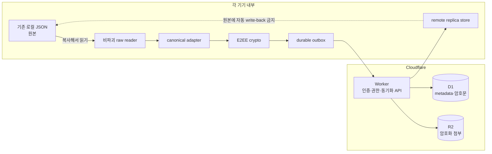

# 크로스 디바이스 동기화 구현 위치 지도

_가가오독 소스 기준 사전조사 · 2026-08-27 · 기준 commit `377b717`_

---

> ⚠️ **범위:** 이 문서는 구현 위치를 미리 찾은 조사 결과다. 앱 코드 수정, 실제 대화 파일 열람, Cloudflare 리소스 생성, Phase 0 실행을 승인하지 않는다.

## 📌 먼저 보는 결론

현재 저장소에는 동기화 전용 client, Cloudflare Worker, D1 schema, R2 uploader가 없다. 기존 Gemini 통신이나 로컬 저장 코드에 동기화를 끼워 넣기보다 **별도 sync 계층**을 만드는 편이 안전하다.

가장 중요한 경계는 다음과 같다.

1. 기존 로컬 JSON은 계속 앱의 원본이다.
2. 동기화는 원본을 읽어 만든 canonical 사본만 다룬다.
3. 일반 메시지 loader는 legacy migration 중 원본을 다시 쓸 수 있으므로 inventory와 최초 import에 사용하지 않는다.
4. 암호화, outbox, Cloudflare 통신은 Gemini 요청 코드와 분리한다.
5. Mac과 Android가 공유하는 것은 **byte 규격과 fixture**이며, 플랫폼 저장 model 자체를 억지로 하나로 합치지 않는다.

## 🧭 전체 구현 경계



초기 read-only 단계에서는 점선 방향을 사용하지 않는다. 양방향 시험도 별도 remote replica와 명시적 operation을 거쳐야 한다.

## 🍎 Mac 구현 접점

| 책임 | 현재 소유 파일·symbol | 조사 결과와 구현 주의점 |
| --- | --- | --- |
| 방·메시지 원본 | [`ChatRoom.swift`](../Sources/KakaoSapiens/Models/ChatRoom.swift)의 `ChatRoomManager` | 저장 위치는 `~/Library/Application Support/KakaoSapiens`. `rooms_list.json`, 메시지, digest, avatar가 함께 있다. |
| 금지 loader | `loadMessagesForRoom(roomId:)` | `migrateLegacyTurns` 후 변경이 있으면 `saveMessagesDirectly`를 호출한다. inventory/importer에서 호출 금지. 검색 색인도 이 loader를 부른다. |
| 메시지 저장 | `saveMessagesForRoom`, `flushPendingSaves`, `write` | 0.7초 지연 저장 후 앱 종료 시 flush한다. sync outbox는 이 지연 저장과 별개로 local commit 성공을 관측해야 한다. |
| 방·persona model | [`ChatRoom.swift`](../Sources/KakaoSapiens/Models/ChatRoom.swift)의 `ChatRoom`, `RoomProfile`, `PersonaStyle` | Swift가 모르는 Android extension을 다시 인코딩해 지우지 않도록 canonical DTO와 opaque extension 보존이 필요하다. |
| 메시지·첨부 model | [`Message.swift`](../Sources/KakaoSapiens/Models/Message.swift)의 `ChatMessage`, `ChatAttachment` | 첨부는 base64 문자열로 메시지 JSON 안에 있다. 일반 파일 첨부는 크기 상한이 없다. 최초 inventory에서 전체 decode를 피해야 한다. |
| 대화 요약 | [`ConversationCompactor.swift`](../Sources/KakaoSapiens/Services/ConversationCompactor.swift) | mentor와 chatbot profile이 다르다. checkpoint에는 schema, profile, contract fingerprint를 기록한다. |
| 기기 비밀 저장 | [`AIModel.swift`](../Sources/KakaoSapiens/Models/AIModel.swift)의 `KeychainStore` | 현재는 API key용이다. sync master key와 device credential은 별도 service/account namespace를 쓰는 `SyncKeyStore`로 분리하는 편이 안전하다. |
| 네트워크 기반 | `URLSession`을 쓰는 Gemini service | 공통 통신 도구로 참고할 수 있지만 sync API를 `GeminiService`에 넣지 않는다. foreground realtime은 별도 client lifecycle이 필요하다. |
| 설정 진입점 | [`KakaoUsageSettingsView.swift`](../Sources/KakaoSapiens/Views/KakaoUsageSettingsView.swift), [`KakaoMainWindowView.swift`](../Sources/KakaoSapiens/Views/KakaoMainWindowView.swift) | 현재 설정 section에 동기화가 없다. pairing·복구·기기 목록은 독립 section으로 추가하는 후보 위치다. |
| 종료 처리 | [`KakaoSapiensApp.swift`](../Sources/KakaoSapiens/App/KakaoSapiensApp.swift)의 `applicationWillTerminate` | outbox flush를 여기 하나에만 의존하면 강제 종료에 약하다. operation 생성 시점에 durable 저장해야 한다. |

### Mac에 새로 둘 후보 모듈

다음 이름은 **구현안**이지 아직 생성된 파일이 아니다.

```text
Sources/KakaoSapiens/Sync/
├── Contract/SyncModels.swift
├── Import/SyncRawInventoryReader.swift
├── Import/SyncCanonicalAdapter.swift
├── Crypto/SyncCrypto.swift
├── Crypto/SyncKeyStore.swift
├── Storage/SyncOutboxStore.swift
├── Storage/SyncReplicaStore.swift
├── Network/SyncClient.swift
├── Network/SyncRealtimeClient.swift
└── SyncCoordinator.swift
```

CryptoKit의 AES-GCM·HKDF·HMAC을 사용하더라도 LP v1 직렬화는 별도 순수 함수로 만들어 Kotlin 고정 vector와 교차검증해야 한다.

## 🤖 Android 구현 접점

| 책임 | 현재 소유 파일·symbol | 조사 결과와 구현 주의점 |
| --- | --- | --- |
| 방·메시지 원본 | [`ChatStore.kt`](../android/app/src/main/java/com/sapiens/gagaodok/data/ChatStore.kt) | 저장 위치는 `context.filesDir/KakaoSapiens`. phone과 tablet flavor는 package가 달라 각각 별도 저장소다. |
| 파일 이름·세계선 | [`ConversationScope.kt`](../android/app/src/main/java/com/sapiens/gagaodok/data/ConversationScope.kt), [`ConversationFiles.kt`](../android/app/src/main/java/com/sapiens/gagaodok/data/ConversationFiles.kt) | room과 nullable worldline이 파일 이름에 들어간다. canonical `worldline_id` 축과 직접 연결되는 지점이다. |
| 금지 loader | `ChatStore.loadMessages(...)` | `migrateLegacyTurns` 후 변경이 있으면 `writeMessages`로 원본을 다시 쓴다. `loadMessagesFresh`도 내부적으로 같은 loader를 부른다. |
| 저장 신뢰성 | `writeMessages`, `writeDigest`, `persistRooms` | `File.renameTo`의 Boolean 결과를 확인하지 않는다. Phase 5 전 local commit 성공 관측을 별도 보정해야 한다. |
| canonical model | [`ChatRoom.kt`](../android/app/src/main/java/com/sapiens/gagaodok/model/ChatRoom.kt), [`Message.kt`](../android/app/src/main/java/com/sapiens/gagaodok/model/Message.kt) | `groupChat`, `baseAffection`, reaction, heart change, `speakerRoomId` 등 Android extension이 있다. |
| group·worldline | [`GroupChatState.kt`](../android/app/src/main/java/com/sapiens/gagaodok/model/GroupChatState.kt) | phone space backup에는 포함하지만 Mac·tablet UI에 노출하지 않는다는 사용자 결정을 adapter에서 적용한다. |
| 첨부 | `ChatRoomInputBar.kt`, `ChatAttachment` | 파일 선택 경로는 12MB를 거부하고 base64로 저장한다. 필기·생성 이미지 등 다른 생성 경로도 inventory에 포함해야 한다. |
| 대화 요약 | [`ConversationCompactor.kt`](../android/app/src/main/java/com/sapiens/gagaodok/service/ConversationCompactor.kt) | 현재 모든 mode가 80/30/50/1500 상수를 쓴다. 사용자 결정대로 mentor 변경은 sync와 분리하고 profile versioning 후 진행한다. |
| 기존 비밀 저장 | [`SecureStore.kt`](../android/app/src/main/java/com/sapiens/gagaodok/data/SecureStore.kt) | API key용 `EncryptedSharedPreferences`다. 열기 실패 시 기존 파일을 삭제하고 빈 저장소를 만든다. **sync master key 저장에 재사용 금지.** |
| 네트워크 기반 | OkHttp dependency와 AI transport | OkHttp 자체는 활용 가능하지만 sync client를 `AIService`에 넣지 않는다. foreground realtime connection은 app lifecycle과 별도 coordinator가 소유한다. |
| 설정 진입점 | [`SettingsScreen.kt`](../android/app/src/main/java/com/sapiens/gagaodok/ui/screens/SettingsScreen.kt) | pairing·복구·연결 기기 관리 section 후보. phone/tablet에서 보일 기능을 product decision에 맞춰 나눈다. |
| background 전환 | [`MainActivity.kt`](../android/app/src/main/java/com/sapiens/gagaodok/MainActivity.kt)의 `onStop` | 현재 pending message를 flush한다. realtime 연결 종료와 마지막 delta pull은 lifecycle에서 처리하되 outbox 내구성을 `onStop`에만 의존하지 않는다. |
| flavor 분기 | `BuildConfig.TABLET_MENTOR` 사용 9개 파일 16곳 | `engineProfile` 도입은 service 한 파일로 끝나지 않는다. UI와 request 직전 routing을 함께 조사해야 한다. |

### Android에 새로 둘 후보 모듈

```text
android/app/src/main/java/com/sapiens/gagaodok/sync/
├── contract/
├── importer/
├── crypto/
├── storage/
├── network/
└── SyncCoordinator.kt
```

Android의 AES-GCM은 JCA로 사용할 수 있지만 HKDF는 작은 RFC 5869 순수 구현과 고정 test vector가 필요하다. master key는 Android Keystore의 non-exportable wrapping key로 감싸며, 기존 `SecureStore`의 자동 삭제 동작과 분리한다.

## ☁️ Cloudflare 구현 접점

현재 repository에는 app-owned `wrangler.toml`, Worker package, D1 migration, R2 binding이 없다. 따라서 server는 기존 코드를 고치는 일이 아니라 **새 package를 만드는 일**이다.

권장 경계는 다음과 같다.

```text
cloudflare/sync-worker/
├── src/
│   ├── auth/
│   ├── pairing/
│   ├── recovery/
│   ├── sync/
│   └── attachments/
├── migrations/
├── test/
└── wrangler.jsonc
```

| 영역 | Worker가 해야 하는 일 | Worker가 하면 안 되는 일 |
| --- | --- | --- |
| 인증 | device token 검증·폐기, recovery verifier 비교 | master key나 복구 문구 평문 저장 |
| pairing | session·claim TTL, 승인된 claim의 1회 redeem | 승인 전 key package 배포 |
| D1 sync | revision CAS, operation idempotency, delta pull | 암호문을 앱 model로 해석·재인코딩 |
| R2 | 비공개 object 저장, 권한 확인 후 중계 또는 단기 접근 | public bucket URL 노출 |
| realtime | “새 변경 있음” 신호 전송 | 알림 payload에 대화 본문 포함 |

Production과 합성 시험 namespace는 처음부터 분리한다. 실제 계정·대화는 Phase 3 승인 전 어느 namespace에도 넣지 않는다.

## 🧩 구현 순서와 병렬화 가능 범위

| 순서 | 작업 | 선행 조건 | 병렬 가능 여부 |
| ---: | --- | --- | --- |
| 1 | LP v1·UUID·date·envelope 순수 codec | Claude Code의 E2EE 독립 재검토 | Swift·Kotlin 병렬 가능 |
| 2 | 합성 canonical DTO와 extension round-trip | 1 | 두 플랫폼 병렬 가능 |
| 3 | 비파괴 inventory reader | Phase 0 계획 승인 | Mac·Android 획득 경로는 병렬 가능 |
| 4 | Crypto + fixed vector | 1 | 두 플랫폼 병렬 가능 |
| 5 | device key store·복구·pairing UI | 4 | UI는 플랫폼별 병렬, protocol test는 공동 |
| 6 | durable outbox·replica store | 2 | local storage 특성이 달라 플랫폼별 구현 |
| 7 | 합성 Worker·D1·R2 | 1·2 | client fixture와 병렬 가능 |
| 8 | read-only UI prototype | 6·7 | 합성 데이터만 사용 |

첫 구현 단위는 “화면”이 아니라 **순수 codec + 양쪽 고정 vector**가 되어야 한다. 여기서 byte가 다르면 이후 QR·복구·암호화가 모두 실패한다.

## 🧪 미리 고정할 test 묶음

### 공통 fixture

- 대문자 UUID, Swift epoch date, nullable worldline
- 같은 turn의 여러 bubble과 불연속 `bubble_order`
- Android 전용 unknown extension
- group·worldline·reaction·heart change
- room/profile field `set`·`clear`
- `delete_turn` tombstone
- checkpoint whole payload와 opaque extension
- 0B, 1B, 상한 근처 attachment metadata

### 보안 fixture

- LP v1 null과 present-empty 구분
- Swift 암호화 → Kotlin 복호화, 반대 방향
- AAD entity·field·bubble order 변경 시 실패
- QR 복제·동시 claim·잘못된 SAS·승인 전 redeem 실패
- recovery record 교체 중 R2 또는 D1 실패 시 기존 문구 유지
- v1 client의 `key_generation != 1` 거부

### 저장 fixture

- 같은 `operation_id` 재시도 시 nonce·ciphertext byte 재사용
- process 종료 직전 outbox operation 보존
- rename 실패를 성공으로 보고하지 않음
- remote replica 저장이 기존 JSON의 byte·mtime·hash를 바꾸지 않음

## 🚧 구현 전 남은 확인

- E2EE 2차 제안의 Claude Code 독립 재검토
- Android QR 생성·scan dependency 선택과 camera permission UX
- Mac이 새 기기일 때 QR scan 방법 선택
- BIP-39 영어 wordlist 출처·license·양쪽 checksum fixture — `english-bip39.txt`,
  `SyncRecoveryMnemonic.swift/.kt`와 zero-entropy checksum 회귀로 완료
- 실제 attachment 최대 크기에 따른 12MB 공통 상한 또는 chunked AEAD 결정
- Android release 데이터의 안전한 export 경로
- 합성 Worker의 CPU·D1 row·R2 request 실측

이 항목들은 조사로 위치는 좁혔지만 아직 구현 결정을 내리거나 실측한 것은 아니다.
